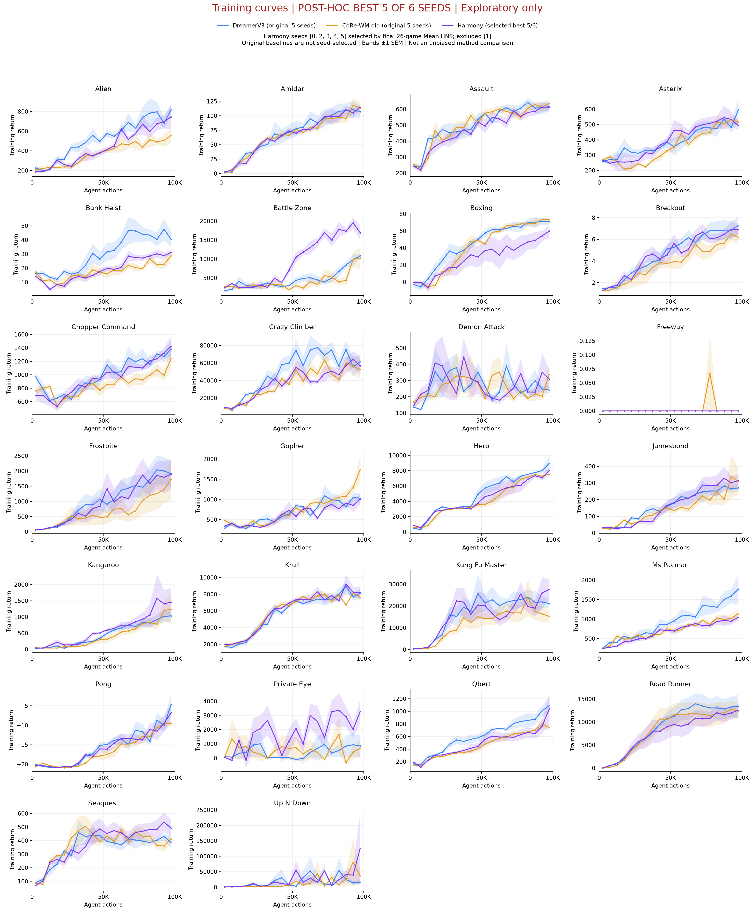
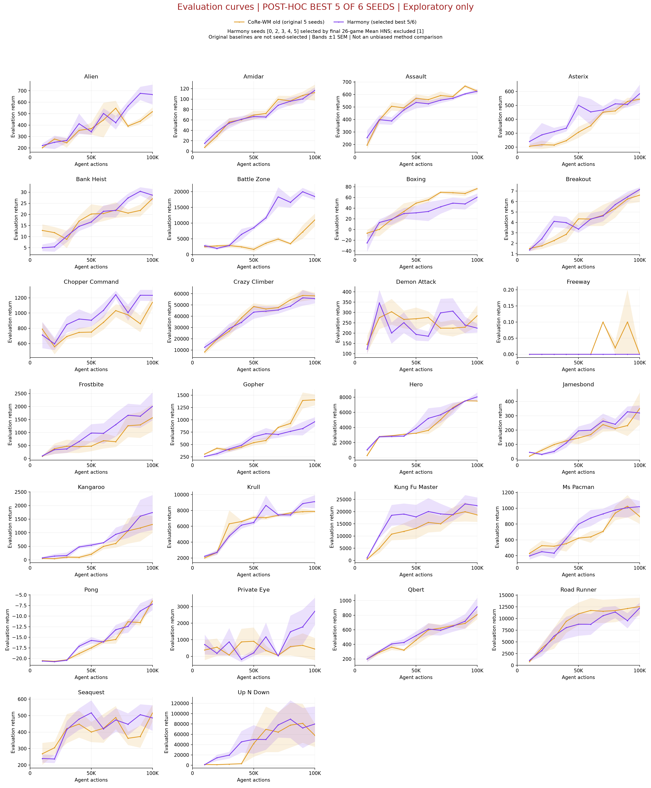

# Harmony: chọn 5 seeds tốt nhất trong 6 — phân tích hậu nghiệm

**Đây là selection-biased exploratory report, không phải kết quả headline hay bằng
chứng cải thiện không chệch.** Giữ nguyên [báo cáo chính seeds 0–4](../harmony_five_seed_results/README.md).

Quy tắc: tính Mean HNS final 100K trên toàn bộ 26 game cho từng seed trong 0–5,
lấy 5 seeds cao nhất; tie-break seed ID tăng dần. **Dùng cùng một tập seed cho tất cả
game/checkpoint**, không chọn 5 seeds khác nhau cho mỗi game.

**Chọn [0, 2, 3, 4, 5]; loại [1].** Tiêu chí Mean HNS dễ bị chi phối bởi các
game có HNS cực lớn như Up N Down. Không lựa chọn lại tiêu chí sau khi nhìn kết quả.

## Xếp hạng

| Seed | Mean HNS (%) | Giữ |
|---|---:|---|
| 0 | 156.47 | True |
| 5 | 107.58 | True |
| 2 | 106.93 | True |
| 3 | 92.85 | True |
| 4 | 84.68 | True |
| 1 | 78.40 | False |

## Aggregate đối chiếu

| Bộ seeds | Mean HNS (%) | Median (%) | IQM (%) | Gap | Superhuman |
|---|---:|---:|---:|---:|---:|
| original_0_to_4 | 103.87 | 27.82 | 28.23 | 0.6075 | 6/26 |
| all_six | 104.49 | 28.89 | 28.74 | 0.6016 | 6/26 |
| selected_five | 109.70 | 28.17 | 30.41 | 0.5939 | 6/26 |

Mỗi run lấy mean 100 final eval episodes; HNS dùng baselines.yaml:atari57_gamer,
không clip. Mean/Median qua game means; IQM trim 25% mỗi đuôi trên run×game scores
theo SciPy floor convention; gap = mean(max(1-HNS,0)). Không báo bootstrap CI trên
bộ đã chọn như thể bộ seed được định trước. Dải curves là ±1 SEM của các seeds
được chọn, không bao gồm selection uncertainty; không dùng nó để kiểm định thắng baseline.

## Training curves

Cả ba dùng training return, bin 5K, trung bình mỗi seed rồi giữa seeds có dữ liệu.
Bin trống giữ gap, không smoothing. Baselines dùng nguyên 5 seeds cũ, không tuyển
chọn; Harmony size25m và CoRe-WM cũ size12m. Vì vậy đây không phải đối chứng công bằng
để khẳng định method vượt baseline.

## Evaluation curves

Harmony selected và CoRe-WM cũ: isolated eval 10K–100K, 10 episodes ở 10K–90K,
100 ở 100K. Không đưa DreamerV3 training data vào evaluation chart.

## Final scores của bộ được chọn

| Game | Mean ± SD | HNS (%) |
|---|---:|---:|
| alien | 667.20 ± 195.04 | 6.37 |
| amidar | 116.73 ± 13.11 | 6.47 |
| assault | 626.03 ± 42.52 | 77.68 |
| asterix | 584.00 ± 146.83 | 4.51 |
| bank_heist | 28.66 ± 6.27 | 1.96 |
| battle_zone | 18452.00 ± 2511.18 | 46.20 |
| boxing | 60.55 ± 15.78 | 503.72 |
| breakout | 7.15 ± 0.50 | 18.92 |
| chopper_command | 1232.80 ± 162.35 | 6.41 |
| crazy_climber | 55687.80 ± 9304.70 | 179.28 |
| demon_attack | 223.82 ± 46.57 | 3.94 |
| freeway | 0.00 ± 0.00 | 0.00 |
| frostbite | 2008.18 ± 1196.92 | 45.51 |
| gopher | 963.16 ± 207.89 | 32.74 |
| hero | 8056.21 ± 1301.70 | 23.59 |
| jamesbond | 320.10 ± 117.27 | 106.32 |
| kangaroo | 1744.00 ± 1438.54 | 56.72 |
| krull | 9124.00 ± 1846.60 | 705.01 |
| kung_fu_master | 22470.60 ± 7540.09 | 98.82 |
| ms_pacman | 1020.80 ± 164.31 | 10.74 |
| pong | -7.16 ± 3.19 | 38.35 |
| private_eye | 2723.38 ± 1825.75 | 3.88 |
| qbert | 916.90 ± 277.15 | 5.67 |
| road_runner | 12270.20 ± 2563.43 | 156.49 |
| seaquest | 485.84 ± 172.63 | 0.99 |
| up_n_down | 79990.58 ± 76015.61 | 711.99 |

## Hình riêng

| Game | Training PNG/PDF | Eval PNG/PDF |
|---|---|---|
| alien | [PNG](training/png/alien.png) / [PDF](training/pdf/alien.pdf) | [PNG](evaluation/png/alien.png) / [PDF](evaluation/pdf/alien.pdf) |
| amidar | [PNG](training/png/amidar.png) / [PDF](training/pdf/amidar.pdf) | [PNG](evaluation/png/amidar.png) / [PDF](evaluation/pdf/amidar.pdf) |
| assault | [PNG](training/png/assault.png) / [PDF](training/pdf/assault.pdf) | [PNG](evaluation/png/assault.png) / [PDF](evaluation/pdf/assault.pdf) |
| asterix | [PNG](training/png/asterix.png) / [PDF](training/pdf/asterix.pdf) | [PNG](evaluation/png/asterix.png) / [PDF](evaluation/pdf/asterix.pdf) |
| bank_heist | [PNG](training/png/bank_heist.png) / [PDF](training/pdf/bank_heist.pdf) | [PNG](evaluation/png/bank_heist.png) / [PDF](evaluation/pdf/bank_heist.pdf) |
| battle_zone | [PNG](training/png/battle_zone.png) / [PDF](training/pdf/battle_zone.pdf) | [PNG](evaluation/png/battle_zone.png) / [PDF](evaluation/pdf/battle_zone.pdf) |
| boxing | [PNG](training/png/boxing.png) / [PDF](training/pdf/boxing.pdf) | [PNG](evaluation/png/boxing.png) / [PDF](evaluation/pdf/boxing.pdf) |
| breakout | [PNG](training/png/breakout.png) / [PDF](training/pdf/breakout.pdf) | [PNG](evaluation/png/breakout.png) / [PDF](evaluation/pdf/breakout.pdf) |
| chopper_command | [PNG](training/png/chopper_command.png) / [PDF](training/pdf/chopper_command.pdf) | [PNG](evaluation/png/chopper_command.png) / [PDF](evaluation/pdf/chopper_command.pdf) |
| crazy_climber | [PNG](training/png/crazy_climber.png) / [PDF](training/pdf/crazy_climber.pdf) | [PNG](evaluation/png/crazy_climber.png) / [PDF](evaluation/pdf/crazy_climber.pdf) |
| demon_attack | [PNG](training/png/demon_attack.png) / [PDF](training/pdf/demon_attack.pdf) | [PNG](evaluation/png/demon_attack.png) / [PDF](evaluation/pdf/demon_attack.pdf) |
| freeway | [PNG](training/png/freeway.png) / [PDF](training/pdf/freeway.pdf) | [PNG](evaluation/png/freeway.png) / [PDF](evaluation/pdf/freeway.pdf) |
| frostbite | [PNG](training/png/frostbite.png) / [PDF](training/pdf/frostbite.pdf) | [PNG](evaluation/png/frostbite.png) / [PDF](evaluation/pdf/frostbite.pdf) |
| gopher | [PNG](training/png/gopher.png) / [PDF](training/pdf/gopher.pdf) | [PNG](evaluation/png/gopher.png) / [PDF](evaluation/pdf/gopher.pdf) |
| hero | [PNG](training/png/hero.png) / [PDF](training/pdf/hero.pdf) | [PNG](evaluation/png/hero.png) / [PDF](evaluation/pdf/hero.pdf) |
| jamesbond | [PNG](training/png/jamesbond.png) / [PDF](training/pdf/jamesbond.pdf) | [PNG](evaluation/png/jamesbond.png) / [PDF](evaluation/pdf/jamesbond.pdf) |
| kangaroo | [PNG](training/png/kangaroo.png) / [PDF](training/pdf/kangaroo.pdf) | [PNG](evaluation/png/kangaroo.png) / [PDF](evaluation/pdf/kangaroo.pdf) |
| krull | [PNG](training/png/krull.png) / [PDF](training/pdf/krull.pdf) | [PNG](evaluation/png/krull.png) / [PDF](evaluation/pdf/krull.pdf) |
| kung_fu_master | [PNG](training/png/kung_fu_master.png) / [PDF](training/pdf/kung_fu_master.pdf) | [PNG](evaluation/png/kung_fu_master.png) / [PDF](evaluation/pdf/kung_fu_master.pdf) |
| ms_pacman | [PNG](training/png/ms_pacman.png) / [PDF](training/pdf/ms_pacman.pdf) | [PNG](evaluation/png/ms_pacman.png) / [PDF](evaluation/pdf/ms_pacman.pdf) |
| pong | [PNG](training/png/pong.png) / [PDF](training/pdf/pong.pdf) | [PNG](evaluation/png/pong.png) / [PDF](evaluation/pdf/pong.pdf) |
| private_eye | [PNG](training/png/private_eye.png) / [PDF](training/pdf/private_eye.pdf) | [PNG](evaluation/png/private_eye.png) / [PDF](evaluation/pdf/private_eye.pdf) |
| qbert | [PNG](training/png/qbert.png) / [PDF](training/pdf/qbert.pdf) | [PNG](evaluation/png/qbert.png) / [PDF](evaluation/pdf/qbert.pdf) |
| road_runner | [PNG](training/png/road_runner.png) / [PDF](training/pdf/road_runner.pdf) | [PNG](evaluation/png/road_runner.png) / [PDF](evaluation/pdf/road_runner.pdf) |
| seaquest | [PNG](training/png/seaquest.png) / [PDF](training/pdf/seaquest.pdf) | [PNG](evaluation/png/seaquest.png) / [PDF](evaluation/pdf/seaquest.pdf) |
| up_n_down | [PNG](training/png/up_n_down.png) / [PDF](training/pdf/up_n_down.pdf) | [PNG](evaluation/png/up_n_down.png) / [PDF](evaluation/pdf/up_n_down.pdf) |

## Nguồn và tái tạo

Lưu đầy đủ raw eval returns của cả 6 seeds, final scores, ranking, training episodes và aggregates trong thư mục này, không chỉ lưu seeds được chọn. [Metadata](metadata.json) ghi SHA256 nguồn. Chạy `sbatch scripts/slurm_harmony_selected_seeds.sh`; [script](../../corewm_eval/harmony_selected_seeds.py). Chỉ CPU EDA, không sửa job training đang chạy. Không gộp các seeds >5 đang chạy vào phép chọn này.
