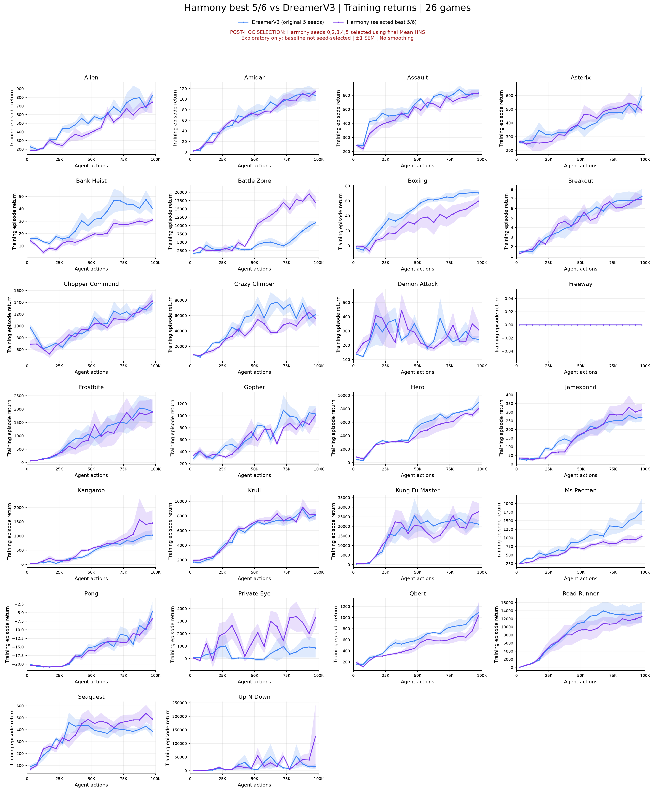

# Harmony best 5/6 vs DreamerV3 — hai đường training return

[PDF tổng quan](all_games_overview.pdf)

Tím: Harmony seeds **0,2,3,4,5**, chọn hậu nghiệm theo final Mean HNS trên 26 game
trong seeds 0–5. Xanh: DreamerV3 nguyên 5 seeds. Đây là **phân tích exploratory có
selection bias**, không thay báo cáo chính hoặc chứng minh thắng baseline.

Cả hai dùng training return: bin 5K actions, mean từng seed rồi giữa seeds có dữ
liệu, dải ±1 SEM (không selection-adjusted CI). Không smoothing, bin trống giữ gap.
Chỉ bỏ đường CoRe-WM khỏi hình, không tính lại/chọn lại seeds hoặc sửa dữ liệu.
[Quy tắc chọn seed và kết quả đủ 6 seeds](../harmony_best5_of6/README.md).

| Game | PNG | PDF |
|---|---|---|
| alien | [PNG](png/alien.png) | [PDF](pdf/alien.pdf) |
| amidar | [PNG](png/amidar.png) | [PDF](pdf/amidar.pdf) |
| assault | [PNG](png/assault.png) | [PDF](pdf/assault.pdf) |
| asterix | [PNG](png/asterix.png) | [PDF](pdf/asterix.pdf) |
| bank_heist | [PNG](png/bank_heist.png) | [PDF](pdf/bank_heist.pdf) |
| battle_zone | [PNG](png/battle_zone.png) | [PDF](pdf/battle_zone.pdf) |
| boxing | [PNG](png/boxing.png) | [PDF](pdf/boxing.pdf) |
| breakout | [PNG](png/breakout.png) | [PDF](pdf/breakout.pdf) |
| chopper_command | [PNG](png/chopper_command.png) | [PDF](pdf/chopper_command.pdf) |
| crazy_climber | [PNG](png/crazy_climber.png) | [PDF](pdf/crazy_climber.pdf) |
| demon_attack | [PNG](png/demon_attack.png) | [PDF](pdf/demon_attack.pdf) |
| freeway | [PNG](png/freeway.png) | [PDF](pdf/freeway.pdf) |
| frostbite | [PNG](png/frostbite.png) | [PDF](pdf/frostbite.pdf) |
| gopher | [PNG](png/gopher.png) | [PDF](pdf/gopher.pdf) |
| hero | [PNG](png/hero.png) | [PDF](pdf/hero.pdf) |
| jamesbond | [PNG](png/jamesbond.png) | [PDF](pdf/jamesbond.pdf) |
| kangaroo | [PNG](png/kangaroo.png) | [PDF](pdf/kangaroo.pdf) |
| krull | [PNG](png/krull.png) | [PDF](pdf/krull.pdf) |
| kung_fu_master | [PNG](png/kung_fu_master.png) | [PDF](pdf/kung_fu_master.pdf) |
| ms_pacman | [PNG](png/ms_pacman.png) | [PDF](pdf/ms_pacman.pdf) |
| pong | [PNG](png/pong.png) | [PDF](pdf/pong.pdf) |
| private_eye | [PNG](png/private_eye.png) | [PDF](pdf/private_eye.pdf) |
| qbert | [PNG](png/qbert.png) | [PDF](pdf/qbert.pdf) |
| road_runner | [PNG](png/road_runner.png) | [PDF](pdf/road_runner.pdf) |
| seaquest | [PNG](png/seaquest.png) | [PDF](pdf/seaquest.pdf) |
| up_n_down | [PNG](png/up_n_down.png) | [PDF](pdf/up_n_down.pdf) |

Tái tạo: `sbatch scripts/slurm_harmony_best_vs_dreamer.sh`. CPU plotting only.
