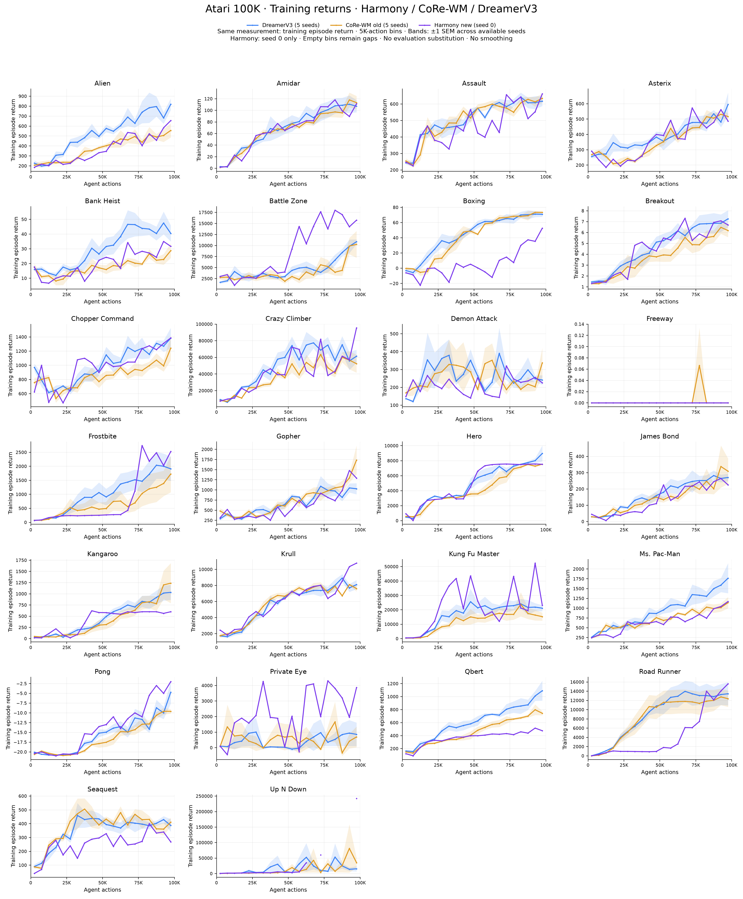

# Cả ba phương pháp theo training return — 26 game

**Bản mới nhất:** [Cả ba phương pháp đủ 5 seeds](../harmony_five_seed_results/README.md). Bộ hình dưới đây giữ nguyên snapshot Harmony chỉ có seed 0.

[PDF tổng quan](all_games_overview.pdf)

**Cả ba đường đều dùng training episode return, không dùng evaluation.**
Xanh: DreamerV3 5 seeds; cam: CoRe-WM cũ 5 seeds; tím: Reborn + Harmony seed 0.

Trung bình episode trong bin 5K actions của từng seed, sau đó trung bình giữa seeds
có dữ liệu. Dải ±1 SEM; bỏ dải khi bin có ít hơn 2 seeds. Cột `seeds` trong CSV ghi
số seed đóng góp thực tế. Bin không có episode kết thúc để trống, không nội suy;
marker giúp nhìn thấy các điểm cô lập. Không smoothing. Bin cuối ở 97.5K gồm
episode kết thúc trong [95K,100K]; không phải final evaluation tại 100K.

CoRe-WM cũ được lấy từ đúng training attempt mà final evaluation trước đây nạp
checkpoint, không chọn attempt có score tốt nhất. Đã kiểm tra đủ 26 × 5 runs,
seed/condition/production commit/action repeat và thời điểm episode tăng nghiêm ngặt.
Alien seed 0 dùng attempt_002, đúng nguồn checkpoint đã evaluation.
CoRe-WM và Harmony dùng agent_actions trong log gốc, không chia logger step ước lượng.
DreamerV3 dùng dữ liệu training đã lưu của hình trước.

Cùng loại metric và binning không đồng nghĩa mọi cấu hình đều matched:
CoRe-WM cũ dùng size12m; Harmony mới dùng size25m, số seeds cũng khác nhau.
Không dùng hình để quy cải thiện duy nhất cho objective. Các seed Harmony 1–4 đang
chạy chưa được ghép vào. Episode dài của Up N Down có thể tạo khoảng trống hợp lệ.

| Game | PNG | PDF |
|---|---|---|
| Alien | [PNG](png/alien.png) | [PDF](pdf/alien.pdf) |
| Amidar | [PNG](png/amidar.png) | [PDF](pdf/amidar.pdf) |
| Assault | [PNG](png/assault.png) | [PDF](pdf/assault.pdf) |
| Asterix | [PNG](png/asterix.png) | [PDF](pdf/asterix.pdf) |
| Bank Heist | [PNG](png/bank_heist.png) | [PDF](pdf/bank_heist.pdf) |
| Battle Zone | [PNG](png/battle_zone.png) | [PDF](pdf/battle_zone.pdf) |
| Boxing | [PNG](png/boxing.png) | [PDF](pdf/boxing.pdf) |
| Breakout | [PNG](png/breakout.png) | [PDF](pdf/breakout.pdf) |
| Chopper Command | [PNG](png/chopper_command.png) | [PDF](pdf/chopper_command.pdf) |
| Crazy Climber | [PNG](png/crazy_climber.png) | [PDF](pdf/crazy_climber.pdf) |
| Demon Attack | [PNG](png/demon_attack.png) | [PDF](pdf/demon_attack.pdf) |
| Freeway | [PNG](png/freeway.png) | [PDF](pdf/freeway.pdf) |
| Frostbite | [PNG](png/frostbite.png) | [PDF](pdf/frostbite.pdf) |
| Gopher | [PNG](png/gopher.png) | [PDF](pdf/gopher.pdf) |
| Hero | [PNG](png/hero.png) | [PDF](pdf/hero.pdf) |
| James Bond | [PNG](png/jamesbond.png) | [PDF](pdf/jamesbond.pdf) |
| Kangaroo | [PNG](png/kangaroo.png) | [PDF](pdf/kangaroo.pdf) |
| Krull | [PNG](png/krull.png) | [PDF](pdf/krull.pdf) |
| Kung Fu Master | [PNG](png/kung_fu_master.png) | [PDF](pdf/kung_fu_master.pdf) |
| Ms. Pac-Man | [PNG](png/ms_pacman.png) | [PDF](pdf/ms_pacman.pdf) |
| Pong | [PNG](png/pong.png) | [PDF](pdf/pong.pdf) |
| Private Eye | [PNG](png/private_eye.png) | [PDF](pdf/private_eye.pdf) |
| Qbert | [PNG](png/qbert.png) | [PDF](pdf/qbert.pdf) |
| Road Runner | [PNG](png/road_runner.png) | [PDF](pdf/road_runner.pdf) |
| Seaquest | [PNG](png/seaquest.png) | [PDF](pdf/seaquest.pdf) |
| Up N Down | [PNG](png/up_n_down.png) | [PDF](pdf/up_n_down.pdf) |

[Aggregate](aggregate.csv) · [CoRe-WM episodes](corewm_training_episodes.csv) · [Per-seed bins](corewm_per_seed.csv) · [Provenance](metadata.json)

Tái tạo: `sbatch scripts/slurm_three_method_training_curves.sh`. CPU Slurm, không chạm các job training.
