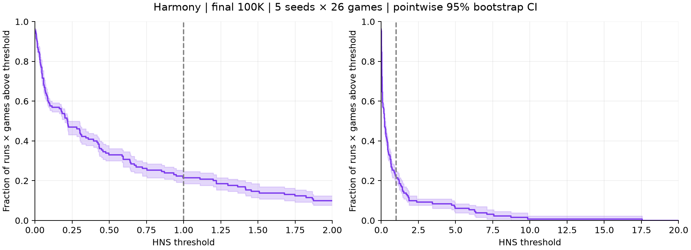
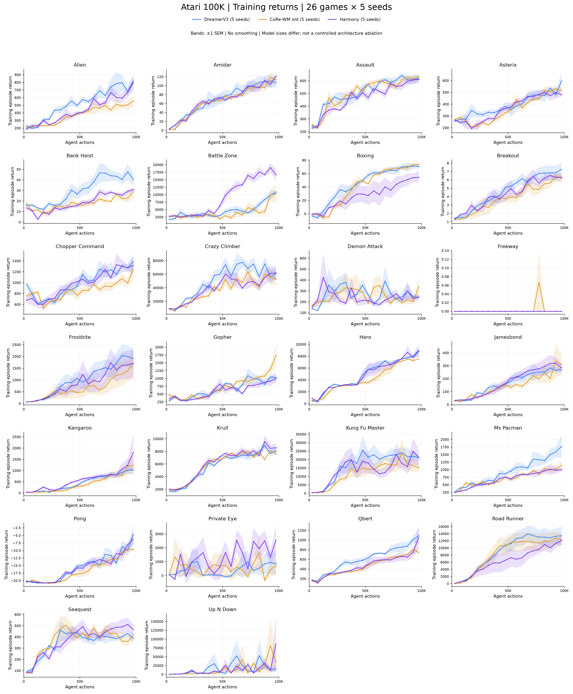
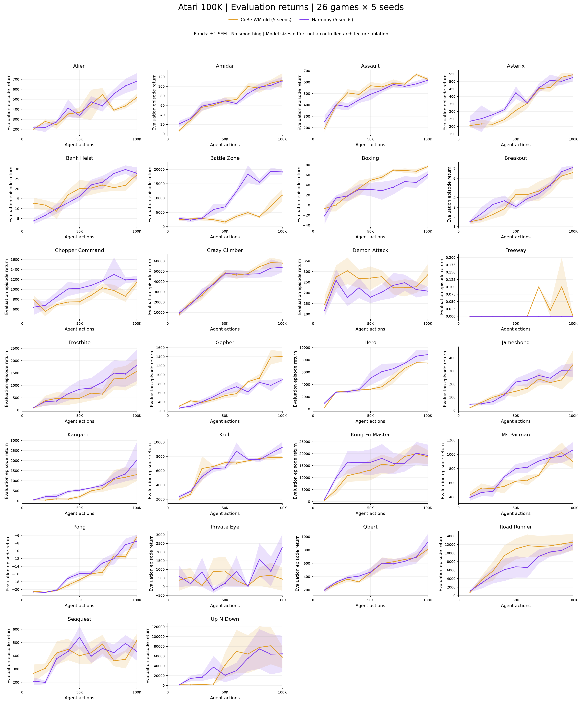

# Harmony — kết quả đầy đủ Atari 100K, 26 game × 5 seeds

Đã hoàn tất seeds 0–4: **130 runs, 1.300 checkpoint evaluations, 24.700 eval episodes**, trong đó 13.000 final episodes. Seeds 1–4 từ job 4080, hoàn tất 14/09/2026 21:20 UTC+7 sau khoảng 32h57m; seed 0 tái sử dụng.

## Headline: checkpoint cuối 100K

| Metric | Estimate | 95% bootstrap CI |
|---|---:|---:|
| mean_hns (%) | 103.868 | [82.854, 129.071] |
| median_hns (%) | 27.818 | [21.531, 30.547] |
| iqm_hns (%) | 28.231 | [25.011, 32.074] |
| optimality_gap | 0.607 | [0.586, 0.629] |

**Games above human: 6/26**, xét mean HNS qua 5 seeds > 1. Không chọn best checkpoint.

## Final score từng game

Mỗi seed: mean 100 eval episodes. SD là sample SD giữa 5 training seeds, không phải CI.

| Game | Seed 0 | Seed 1 | Seed 2 | Seed 3 | Seed 4 | Mean ± SD | HNS (%) |
|---|---:|---:|---:|---:|---:|---:|---:|
| alien | 637.80 | 551.30 | 821.50 | 911.10 | 482.70 | 680.88 ± 180.76 | 6.57 |
| amidar | 111.76 | 86.42 | 138.99 | 116.10 | 104.67 | 111.59 ± 19.06 | 6.17 |
| assault | 613.62 | 531.30 | 665.15 | 675.36 | 598.50 | 616.79 ± 57.93 | 75.90 |
| asterix | 504.00 | 541.50 | 488.50 | 482.50 | 617.50 | 526.80 ± 55.66 | 3.82 |
| bank_heist | 37.80 | 23.40 | 26.20 | 31.20 | 21.00 | 27.92 ± 6.70 | 1.86 |
| battle_zone | 18290.00 | 19700.00 | 22770.00 | 17390.00 | 17470.00 | 19124.00 ± 2239.59 | 48.13 |
| boxing | 41.39 | 59.76 | 56.99 | 85.32 | 59.21 | 60.53 ± 15.78 | 503.62 |
| breakout | 7.49 | 7.42 | 6.45 | 7.53 | 6.79 | 7.14 ± 0.49 | 18.88 |
| chopper_command | 1012.00 | 1281.00 | 1347.00 | 1261.00 | 1131.00 | 1206.40 ± 133.97 | 6.01 |
| crazy_climber | 70558.00 | 46320.00 | 52832.00 | 54609.00 | 44925.00 | 53848.80 ± 10211.83 | 171.94 |
| demon_attack | 182.55 | 181.20 | 212.85 | 285.35 | 180.30 | 208.45 ± 45.11 | 3.10 |
| freeway | 0.00 | 0.00 | 0.00 | 0.00 | 0.00 | 0.00 ± 0.00 | 0.00 |
| frostbite | 2921.40 | 241.00 | 2816.10 | 279.60 | 2804.30 | 1812.48 ± 1417.74 | 40.92 |
| gopher | 1029.20 | 921.80 | 733.80 | 863.60 | 905.60 | 890.80 ± 106.92 | 29.38 |
| hero | 7626.60 | 11220.10 | 10371.30 | 7491.10 | 7541.70 | 8850.16 ± 1801.85 | 26.25 |
| jamesbond | 191.50 | 284.50 | 203.50 | 442.00 | 416.50 | 307.60 ± 117.02 | 101.75 |
| kangaroo | 596.00 | 5494.00 | 2080.00 | 720.00 | 1228.00 | 2023.60 ± 2025.91 | 66.09 |
| krull | 12106.60 | 8384.30 | 7899.80 | 8314.40 | 9683.90 | 9277.80 ± 1717.00 | 719.42 |
| kung_fu_master | 29438.00 | 7039.00 | 9975.00 | 27193.00 | 22648.00 | 19258.60 ± 10168.17 | 84.53 |
| ms_pacman | 1072.20 | 1493.20 | 971.50 | 916.10 | 863.90 | 1063.38 ± 252.36 | 11.38 |
| pong | -4.91 | -12.73 | -3.89 | -5.93 | -10.04 | -7.50 ± 3.74 | 37.39 |
| private_eye | 1496.79 | 1665.65 | 4036.51 | 4040.61 | 100.00 | 2267.91 ± 1726.82 | 3.23 |
| qbert | 630.00 | 784.50 | 782.25 | 1329.75 | 1056.00 | 916.50 ± 277.38 | 5.66 |
| road_runner | 14620.00 | 11410.00 | 9565.00 | 14679.00 | 9580.00 | 11970.80 ± 2557.88 | 152.67 |
| seaquest | 237.20 | 373.20 | 464.60 | 663.60 | 429.20 | 433.56 ± 155.00 | 0.87 |
| up_n_down | 196432.50 | 5279.30 | 97739.80 | 12935.30 | 11140.10 | 64705.40 ± 82952.01 | 575.03 |

## Cách tính và giới hạn

HNS(g,s) = (mean_final_return(g,s) − random(g)) / (human(g) − random(g)).
Dùng reference đầy đủ precision từ `baselines.yaml:atari57_gamer`; không clip HNS.
Mean/Median HNS: mean/median của 26 game means qua seeds. IQM: `scipy.stats.trim_mean`
trên 130 run×game HNS, bỏ floor(130×0.25)=32 điểm mỗi đuôi, trung bình 66 điểm còn lại.
Optimality gap: mean(max(1−HNS,0)) trên 130 điểm; ngưỡng human-level, thấp hơn tốt hơn.

95% CI: 20.000 stratified bootstrap replicates; mỗi game cố định resample 5 training
runs có hoàn lại, độc lập giữa games, rồi tính lại estimator. RNG seed 20260914;
percentile 2.5/97.5. Không bootstrap episodes làm training seeds, không resample games.
CI phản ánh uncertainty từ 5 runs quan sát trên suite cố định, không bảo đảm bao phủ
mọi failure mode. Performance profile dùng toàn bộ run×game; bands là pointwise CI,
không phải simultaneous confidence band. Công thức estimator tương ứng
[rliable](https://github.com/google-research/rliable/blob/master/rliable/metrics.py);
bootstrap ở đây được triển khai bằng NumPy, không gọi trực tiếp rliable.

Script kiểm tra đủ matrix 26×5×10, không duplicate, episode counts, finite returns,
mean khớp raw episodes; đối chiếu IQM/gap bằng công thức tương đương.

## Performance profile

## Training curves: cả ba bản đủ 5 seeds

Harmony, DreamerV3 và CoRe-WM cũ đều dùng **training return**: bin 5K actions mỗi
seed, rồi mean ±1 SEM giữa seeds có dữ liệu. Số seeds/bin nằm trong CSV; bin trống
giữ gap, không nội suy, không smoothing. SEM không phải 95% CI. Harmony/CoRe-WM dùng
agent_actions gốc; DreamerV3 dùng reference training đã cache. Điểm cuối bin không
thay thế final evaluation. Không pooling episodes qua seeds để bias seed có episode ngắn.

## Isolated evaluation curves

Chỉ Harmony và CoRe-WM cũ: cùng lịch 10K–100K và số eval episodes/checkpoint.
Không đưa DreamerV3 training return vào hình evaluation. Cùng measurement/budget
không đảm bảo matched architecture: Harmony size25m, CoRe-WM cũ size12m. Không quy
mọi khác biệt cho method hoặc tuyên bố thắng paper DreamerV3 từ các hình này.
Không báo probability of improvement với DreamerV3 do thiếu matched final eval data.

## Observation chính

Up N Down: seeds 0/2 đạt 196432.5/97739.8 nhưng seeds 1/3/4 chỉ 5279.3/12935.3/11140.1.
Thành công cao được tái lập ở hơn một seed, nhưng không ổn định; Mean HNS vẫn nhạy
đuôi lớn nên phải đọc cùng Median/IQM và CI. Frostbite có nhóm seeds 0/2/4 khoảng
2800–2900, seeds 1/3 khoảng 240–280; không thể kết luận nguyên nhân chỉ từ score.
Đây là cấu hình được chọn sau screening, không phải đánh giá xác nhận hoàn toàn
độc lập khỏi quá trình chọn method. Evaluation có giới hạn episode; không ngoại suy
return không giới hạn của Up N Down. Chi tiết seed-0 long episodes:
[báo cáo trước](../upndown_long_episode_report/README.md).

[EDA chi tiết Up N Down seed 0 vs seed 1](../upndown_harmony_seed0_vs_seed1/README.md)
được giữ như phân tích hai seeds, không thay thế kết quả đủ năm seeds ở trên.

## Hình riêng từng game

| Game | Training PNG | Training PDF | Eval PNG | Eval PDF |
|---|---|---|---|---|
| alien | [PNG](training/png/alien.png) | [PDF](training/pdf/alien.pdf) | [PNG](evaluation/png/alien.png) | [PDF](evaluation/pdf/alien.pdf) |
| amidar | [PNG](training/png/amidar.png) | [PDF](training/pdf/amidar.pdf) | [PNG](evaluation/png/amidar.png) | [PDF](evaluation/pdf/amidar.pdf) |
| assault | [PNG](training/png/assault.png) | [PDF](training/pdf/assault.pdf) | [PNG](evaluation/png/assault.png) | [PDF](evaluation/pdf/assault.pdf) |
| asterix | [PNG](training/png/asterix.png) | [PDF](training/pdf/asterix.pdf) | [PNG](evaluation/png/asterix.png) | [PDF](evaluation/pdf/asterix.pdf) |
| bank_heist | [PNG](training/png/bank_heist.png) | [PDF](training/pdf/bank_heist.pdf) | [PNG](evaluation/png/bank_heist.png) | [PDF](evaluation/pdf/bank_heist.pdf) |
| battle_zone | [PNG](training/png/battle_zone.png) | [PDF](training/pdf/battle_zone.pdf) | [PNG](evaluation/png/battle_zone.png) | [PDF](evaluation/pdf/battle_zone.pdf) |
| boxing | [PNG](training/png/boxing.png) | [PDF](training/pdf/boxing.pdf) | [PNG](evaluation/png/boxing.png) | [PDF](evaluation/pdf/boxing.pdf) |
| breakout | [PNG](training/png/breakout.png) | [PDF](training/pdf/breakout.pdf) | [PNG](evaluation/png/breakout.png) | [PDF](evaluation/pdf/breakout.pdf) |
| chopper_command | [PNG](training/png/chopper_command.png) | [PDF](training/pdf/chopper_command.pdf) | [PNG](evaluation/png/chopper_command.png) | [PDF](evaluation/pdf/chopper_command.pdf) |
| crazy_climber | [PNG](training/png/crazy_climber.png) | [PDF](training/pdf/crazy_climber.pdf) | [PNG](evaluation/png/crazy_climber.png) | [PDF](evaluation/pdf/crazy_climber.pdf) |
| demon_attack | [PNG](training/png/demon_attack.png) | [PDF](training/pdf/demon_attack.pdf) | [PNG](evaluation/png/demon_attack.png) | [PDF](evaluation/pdf/demon_attack.pdf) |
| freeway | [PNG](training/png/freeway.png) | [PDF](training/pdf/freeway.pdf) | [PNG](evaluation/png/freeway.png) | [PDF](evaluation/pdf/freeway.pdf) |
| frostbite | [PNG](training/png/frostbite.png) | [PDF](training/pdf/frostbite.pdf) | [PNG](evaluation/png/frostbite.png) | [PDF](evaluation/pdf/frostbite.pdf) |
| gopher | [PNG](training/png/gopher.png) | [PDF](training/pdf/gopher.pdf) | [PNG](evaluation/png/gopher.png) | [PDF](evaluation/pdf/gopher.pdf) |
| hero | [PNG](training/png/hero.png) | [PDF](training/pdf/hero.pdf) | [PNG](evaluation/png/hero.png) | [PDF](evaluation/pdf/hero.pdf) |
| jamesbond | [PNG](training/png/jamesbond.png) | [PDF](training/pdf/jamesbond.pdf) | [PNG](evaluation/png/jamesbond.png) | [PDF](evaluation/pdf/jamesbond.pdf) |
| kangaroo | [PNG](training/png/kangaroo.png) | [PDF](training/pdf/kangaroo.pdf) | [PNG](evaluation/png/kangaroo.png) | [PDF](evaluation/pdf/kangaroo.pdf) |
| krull | [PNG](training/png/krull.png) | [PDF](training/pdf/krull.pdf) | [PNG](evaluation/png/krull.png) | [PDF](evaluation/pdf/krull.pdf) |
| kung_fu_master | [PNG](training/png/kung_fu_master.png) | [PDF](training/pdf/kung_fu_master.pdf) | [PNG](evaluation/png/kung_fu_master.png) | [PDF](evaluation/pdf/kung_fu_master.pdf) |
| ms_pacman | [PNG](training/png/ms_pacman.png) | [PDF](training/pdf/ms_pacman.pdf) | [PNG](evaluation/png/ms_pacman.png) | [PDF](evaluation/pdf/ms_pacman.pdf) |
| pong | [PNG](training/png/pong.png) | [PDF](training/pdf/pong.pdf) | [PNG](evaluation/png/pong.png) | [PDF](evaluation/pdf/pong.pdf) |
| private_eye | [PNG](training/png/private_eye.png) | [PDF](training/pdf/private_eye.pdf) | [PNG](evaluation/png/private_eye.png) | [PDF](evaluation/pdf/private_eye.pdf) |
| qbert | [PNG](training/png/qbert.png) | [PDF](training/pdf/qbert.pdf) | [PNG](evaluation/png/qbert.png) | [PDF](evaluation/pdf/qbert.pdf) |
| road_runner | [PNG](training/png/road_runner.png) | [PDF](training/pdf/road_runner.pdf) | [PNG](evaluation/png/road_runner.png) | [PDF](evaluation/pdf/road_runner.pdf) |
| seaquest | [PNG](training/png/seaquest.png) | [PDF](training/pdf/seaquest.pdf) | [PNG](evaluation/png/seaquest.png) | [PDF](evaluation/pdf/seaquest.pdf) |
| up_n_down | [PNG](training/png/up_n_down.png) | [PDF](training/pdf/up_n_down.pdf) | [PNG](evaluation/png/up_n_down.png) | [PDF](evaluation/pdf/up_n_down.pdf) |

## Dữ liệu và tái tạo

[Raw evaluation returns](evaluation_results.json) · [Final per seed](final_per_seed.csv) · [Metrics + CI](metrics.json) · [Provenance](metadata.json)

Training episodes, per-seed bins, aggregates, profile CSV được lưu cùng thư mục. Không commit checkpoints/replay/ROM.

Submit CPU: `sbatch scripts/slurm_harmony_five_seed_report.sh`. Script: [harmony_five_seed_report.py](../../corewm_eval/harmony_five_seed_report.py). Tái tạo cần training logs gốc; toàn bộ raw eval returns và processed curve data đã được export để người đọc phân tích mà không cần checkpoint. [Cách train lại](../../reproduction/harmony/README.md).
