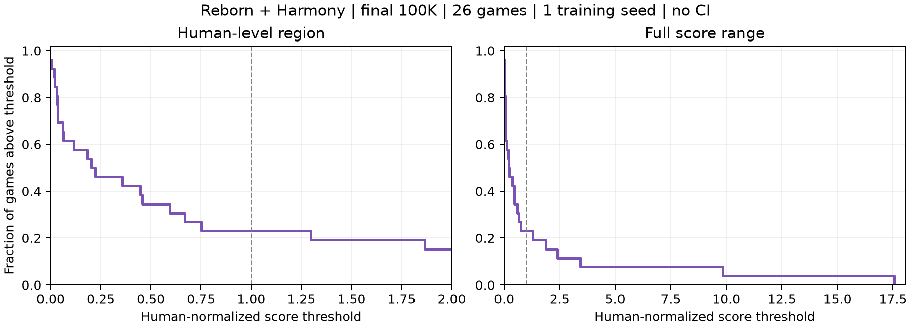

# Reborn + Harmony — Atari 100K, một training seed

**Cập nhật:** [Kết quả đầy đủ 5 seeds đã hoàn tất](../harmony_five_seed_results/README.md). Bản dưới đây được giữ làm snapshot lịch sử seed 0, không phải kết quả tổng hợp mới nhất.

**Kết quả sơ bộ, không phải kết quả đa training seed.** 26 game, training seed 0;
mỗi game lấy trung bình 100 evaluation episodes riêng tại checkpoint cuối 100.000
agent actions (400.000 frames với action repeat 4). Tổng cộng 2.600 final episodes.
Không chọn best checkpoint, không dùng training return thay evaluation return.
Bốn game Boxing/Up N Down/Frostbite/Road Runner từ screening job 3897;
22 game còn lại từ job 3997, cùng cấu hình Harmony. Đây là cấu hình đã được chọn
sau các vòng nghiên cứu, không phải đánh giá xác nhận độc lập chưa qua lựa chọn.

## Kết quả tổng hợp

| Metric | Giá trị |
|---|---:|
| Mean HNS (%) | 156.47 |
| Median HNS (%) | 21.13 |
| IQM HNS (%) | 29.93 |
| Optimality gap, ngưỡng HNS = 1 | 0.6041 |
| Số game vượt human (HNS > 1) | 6/26 |

## Final score từng game

Random/human dùng chính xác bảng `atari57_gamer` trong `baselines.yaml`, không
làm tròn các reference thành số nguyên trước khi tính. HNS không clip âm hoặc >1.

| Game | Random | Human | Final return (100 episodes) | HNS (%) |
|---|---:|---:|---:|---:|
| alien | 227.8 | 7127.7 | 637.80 | 5.94 |
| amidar | 5.8 | 1719.5 | 111.76 | 6.18 |
| assault | 222.4 | 742.0 | 613.62 | 75.29 |
| asterix | 210.0 | 8503.3 | 504.00 | 3.55 |
| bank_heist | 14.2 | 753.1 | 37.80 | 3.19 |
| battle_zone | 2360.0 | 37187.5 | 18290.00 | 45.74 |
| boxing | 0.1 | 12.1 | 41.39 | 344.08 |
| breakout | 1.7 | 30.5 | 7.49 | 20.10 |
| chopper_command | 811.0 | 7387.8 | 1012.00 | 3.06 |
| crazy_climber | 10780.5 | 35829.4 | 70558.00 | 238.64 |
| demon_attack | 152.1 | 1971.0 | 182.55 | 1.67 |
| freeway | 0.0 | 29.6 | 0.00 | 0.00 |
| frostbite | 65.2 | 4334.7 | 2921.40 | 66.90 |
| gopher | 257.6 | 2412.5 | 1029.20 | 35.81 |
| hero | 1027.0 | 30826.4 | 7626.60 | 22.15 |
| jamesbond | 29.0 | 302.8 | 191.50 | 59.35 |
| kangaroo | 52.0 | 3035.0 | 596.00 | 18.24 |
| krull | 1598.0 | 2665.5 | 12106.60 | 984.41 |
| kung_fu_master | 258.5 | 22736.3 | 29438.00 | 129.81 |
| ms_pacman | 307.3 | 6951.6 | 1072.20 | 11.51 |
| pong | -20.7 | 14.6 | -4.91 | 44.73 |
| private_eye | 24.9 | 69571.3 | 1496.79 | 2.12 |
| qbert | 163.9 | 13455.0 | 630.00 | 3.51 |
| road_runner | 11.5 | 7845.0 | 14620.00 | 186.49 |
| seaquest | 68.4 | 42054.7 | 237.20 | 0.40 |
| up_n_down | 533.4 | 11693.2 | 196432.50 | 1755.40 |

## Công thức và implementation

Với game g, R_g là trung bình 100 final episode returns của seed 0:

$$H_g = (R_g-R_g^{random})/(R_g^{human}-R_g^{random}).$$

- Mean HNS: trung bình 26 giá trị H_g; Median HNS: median của chúng.
- IQM: `scipy.stats.trim_mean(hns, 0.25)`, cùng quy ước implementation
  [rliable](https://github.com/google-research/rliable/blob/master/rliable/metrics.py).
  Với 26 điểm, bỏ floor(26 × 0,25) = 6 điểm ở mỗi đuôi, trung bình 14 điểm còn lại.
  Khi mở rộng đa seed, IQM dùng toàn bộ ma trận run × game, không lấy trung bình
  seed trước khi trim. Mean/Median dùng trung bình theo seed của từng game.
- Optimality gap: trung bình `max(1 - H_g, 0)`, nhỏ hơn tốt hơn; đây là mức thiếu
  so với human, không phải khoảng cách tới policy tối ưu thật.
- Superhuman: đếm game H_g > 1; không phải kiểm định ý nghĩa thống kê.
- Performance profile: tại ngưỡng τ, tỷ lệ game có H_g > τ. Mỗi game trọng số bằng nhau.
  Không smoothing và không có confidence band.

Implementation: [harmony_single_seed_report.py](../../corewm_eval/harmony_single_seed_report.py).
Reference loader: [hns_reference.py](../../corewm_eval/hns_reference.py).
Script kiểm tra đủ 26 game duy nhất, 100 finite returns/game, đúng checkpoint/seed,
mean khớp dữ liệu nguồn, và đối chiếu IQM/gap bằng công thức tương đương.

## Performance profile

[PDF](performance_profile.pdf) · [Dữ liệu profile](performance_profile.csv)

## Diễn giải và giới hạn

Up N Down đạt HNS 1755.40%, đóng góp
67.52 điểm phần trăm vào Mean HNS của toàn bộ 26 game.
Vì vậy phải đọc Mean cùng Median/IQM, không suy từ Mean rằng mọi game đều cải thiện.
Giữ nguyên Up N Down trong aggregate chuẩn, không loại outlier để điều chỉnh kết quả.
[Báo cáo episode dài](../upndown_long_episode_report/README.md) ghi nhận 29/100 final
episodes chạm đúng 27.000 actions; đây là proxy time cap, không có termination-cause
log để khẳng định từng episode bị truncation. Không ngoại suy return ngoài giới hạn.

Không báo 95% training-seed CI: một seed không xác định được biến thiên huấn luyện.
100 eval episodes không phải 100 training seeds. Không bootstrap episodes rồi gọi
là CI đa seed; không báo probability of improvement với baseline chưa có dữ liệu
run-level theo phép đo tương thích. DreamerV3 training curves đã lưu không được dùng
như isolated final evaluation để tuyên bố thắng/thua. Báo cáo này không lập bảng
xếp hạng với số từ paper có protocol chưa đối chiếu.

## Nguồn và tái tạo

- [Raw evaluation returns + checkpoint hashes](../harmony_vs_dreamerv3_26_learning_curves/evaluation_results.json).
- [Protocol/source metadata](../harmony_vs_dreamerv3_26_learning_curves/plot_metadata.json).
- [Per-game CSV](per_game.csv), [metric JSON và SHA256 nguồn](metrics.json).
- Reference: [baselines.yaml](../../baselines.yaml), section `atari57_gamer`.
- Chạy `sbatch scripts/slurm_harmony_single_seed_report.sh` từ repository root.
  Job CPU chỉ đọc kết quả có sẵn; không train/eval lại, không dùng GPU.
