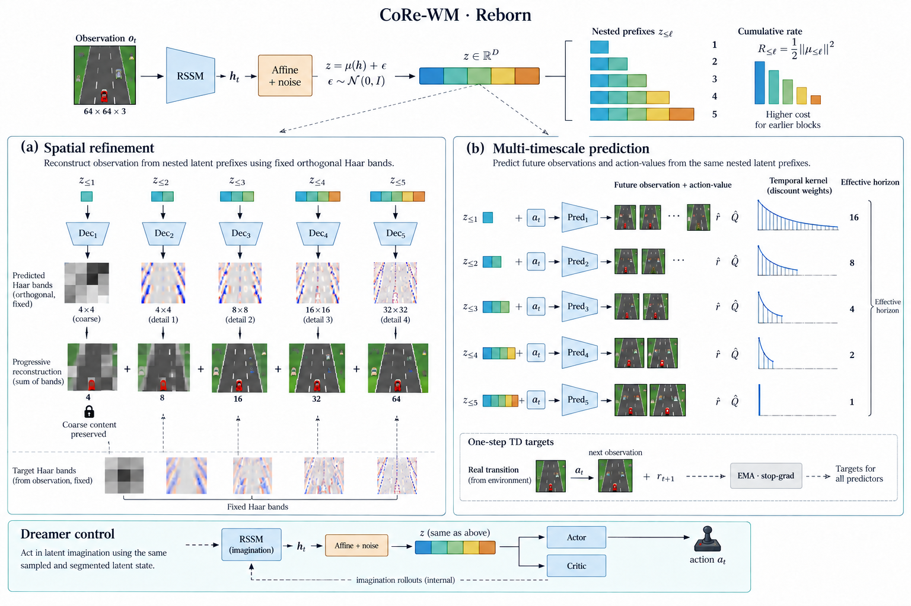
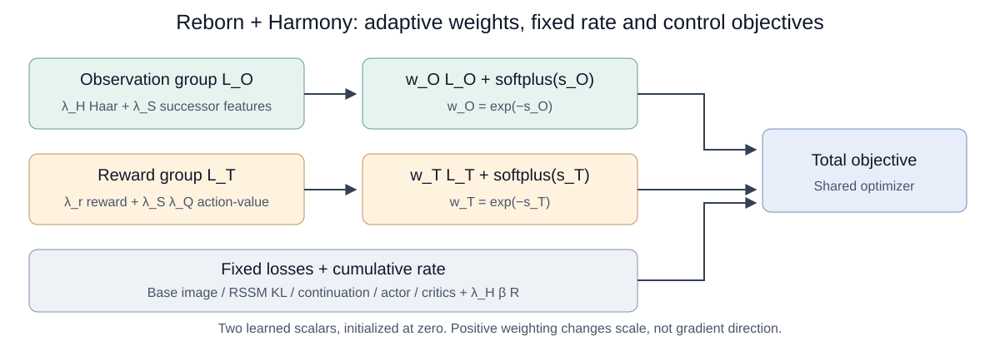

# CoRe-WM · Reborn + Harmony — Technical Report

**Bản tiếng Việt · snapshot 13/09/2026 · branch reborn**

## Tóm tắt

Reborn + Harmony là **ứng viên chính hiện tại** của dự án: representation ngẫu nhiên theo prefix, tái tạo các dải Haar có context, dự đoán successor observation/action-value ở nhiều thang thời gian, và hai scalar học được để cân bằng nhóm observation với nhóm reward. RSSM, decoder observation gốc và actor–critic Dreamer được giữ lại.

Trong screening cùng source, seed 0, train 100K agent actions và final evaluation 100 episode/game, Harmony đạt **41.39 Boxing, 196432.50 Up N Down, 2921.40 Frostbite, 14620 Road Runner**. “Bản tốt nhất” là lựa chọn nghiên cứu tiếp, **không phải kết luận thắng mọi phiên bản trên 26 game/nhiều seed**.

Bằng chứng mạnh nhất là control của Up N Down. Cơ chế chưa được cô lập: observation weight tăng gần 3 lần cũng làm giảm compression tương đối. Report tách định nghĩa toán, implementation, kết quả và giả thuyết.

## 1. Phạm vi và nguồn sự thật

- Screening: production_runs/reborn_harmony_2ew6wt0w, Slurm 3897, hai arm Full và Harmony, đã COMPLETE.
- **Full là Reborn fixed-weight**, không phải DreamerV3 nguyên bản và không phải constraint cũ.
- Mở rộng: production_runs/harmony_remaining22_zvn1urx5, 22 game còn lại, seed 0; snapshot còn RUNNING. Không nhập kết quả chưa hoàn tất vào bảng final.
- [Evidence snapshot](evidence_snapshot.json): checkpoint curve, final score/hash, metric cuối log, diagnostic aggregate và trạng thái 22 game.
- Source đúng run: [agent_reborn.py](implementation/agent_reborn.py), [reborn.py](implementation/reborn.py); [cấu hình Boxing đã resolve](implementation/boxing_seed0_config.yaml).
- Hai file Python là bản tham chiếu đóng băng, **không phải package standalone**; còn phụ thuộc Dreamer/embodied và runner trong repository. HEAD đang phát triển không thay thế provenance của run.

## 2. Động cơ và tổng quan

Predict latent tương lai không xác định latent phải chứa semantic nào. Tái tạo cùng một full latent ở mọi prefix cũng không tự định nghĩa coarse/fine. Reborn thay mục tiêu, thay vì cộng thêm persistence/isotropy để sửa biểu hiện.

Hình là conceptual, không phải ảnh reconstruction thực nghiệm, và chưa chứa Harmony. Hai objective học **đồng thời**, không phải hai giai đoạn pretrain nối tiếp. [Giải thích từng khối](../method_illustration/README_VI.md).

Ba nguyên tắc: **target cố định** từ observation/reward; **information cost** trên code ngẫu nhiên; **adaptive weights** cho các nhóm tín hiệu học.

Rectified harmonizer kế thừa [HarmonyDream, ICML 2024](https://arxiv.org/abs/2310.00344). Việc gom Haar/SF và reward/Q là thiết kế riêng của Reborn, không phải tái lập nguyên cấu hình paper. Không claim cơ chế sửa hướng gradient.

## 3. Kiến trúc và stochastic representation

$h_t$ là deterministic RSSM state ghép stochastic state đã flatten. Preset size25m dùng deter 3072, stochastic 32 categorical × 24 classes, nên feature rộng **3840**.

$$
\mu_t=W_\psi h_t+b_\psi,\qquad z_t=\mu_t+\epsilon_t,\qquad
\epsilon_t\sim\mathcal N(0,I).
$$

Affine projection trực tiếp xuất 2048 coordinate, không đi qua trunk 512 rồi mở rộng. Điều này loại bottleneck kiến trúc cụ thể; không chứng minh learned matrix full rank hay các block độc lập.

| Level | Prefix dim | Block dim | Ảnh tích lũy | Haar band dim | SF output dim | $\Delta$ | $\gamma$ |
|---|---:|---:|---:|---:|---:|---:|---:|
| 1 | 128 | 128 | 4×4 | 48 | 48 | 16 | 15/16 |
| 2 | 256 | 128 | 8×8 | 144 | 192 | 8 | 7/8 |
| 3 | 512 | 256 | 16×16 | 576 | 768 | 4 | 3/4 |
| 4 | 1024 | 512 | 32×32 | 2304 | 3072 | 2 | 1/2 |
| 5 | 2048 | 1024 | 64×64 | 9216 | 12288 | 1 | 0 |

$z^{(\ell)}$ là block riêng; $z^{(1:\ell)}$ là toàn bộ prefix. Refinement head: một hidden layer 512, SiLU/RMSNorm và linear output. Outcome head: hai hidden layer 512 nhận prefix + action, chia thành linear SF output và Q symexp-twohot 255 bins.

Noise làm tín hiệu nhỏ khó đọc, ngăn né rate bằng cách thu nhỏ code rồi khuếch đại decoder mà không mất SNR. Trong posterior training, một sample được reuse giữa projected heads; auxiliary detach backbone nhưng giữ cùng giá trị code. Trong imagination, lưu code đã sinh action để reuse khi tính log-probability/value/reward. **Evaluation vẫn dùng noise**, không thay code bằng mean.

Actor, critic, reward và continuation dùng projected code. Decoder observation Dreamer gốc vẫn dùng RSSM feature. Target copies chỉ gồm projection và outcomes, không thêm EMA backbone.

## 4. Spatial refinement và cumulative rate

### 4.1 Target Haar có context

Ảnh RGB được scale o/255 về [0,1], $N=64\cdot64\cdot3=12288$. Haar trực chuẩn cho:

$$
b_t^{(\ell)}=B_\ell^\top o_t,\qquad
\widehat b_t^{(\ell)}=G_\ell(z_t^{(1:\ell)}),\qquad
\widehat o_t^{(1:\ell)}=\sum_{j=1}^{\ell}B_j\widehat b_t^{(j)}.
$$

Haar lấy tổ hợp tổng/chênh lệch pixel trong nhóm 2×2, chia 2 để giữ chuẩn trực giao. Coarse giữ bố cục; detail giữ biến thiên theo scale/hướng, không mặc nhiên là object semantics. Head sau dùng lại context trước. $B_j\widehat b^{(j)}$ đưa hệ số về không gian ảnh trước khi cộng, không cộng trực tiếp các vector khác kích thước.

Với $P_\ell$ là phép chiếu lên không gian ảnh tích lũy:

$$
P_{\ell-1}\widehat o_t^{(1:\ell)}
=\widehat o_t^{(1:\ell-1)}.
$$

Thêm detail không ghi đè coarse trong cùng forward pass trước clipping. **Full error vẫn có thể tăng** nếu detail head dự đoán sai.

$$
D_H=\mathbb E\left[\frac1N\sum_{\ell=1}^L
\|b_t^{(\ell)}-\widehat b_t^{(\ell)}\|_2^2\right].
$$

Normalization chung theo N giữ đẳng thức Parseval với full-image MSE. Không lấy mean riêng từng band rồi vô tình tăng trọng số band ít hệ số.

### 4.2 Chi phí thông tin

$$
R_j(h)=D_{\mathrm{KL}}\big(\mathcal N(\mu^{(j)}(h),I)\,\|\,\mathcal N(0,I)\big)
=\tfrac12\|\mu^{(j)}(h)\|_2^2,
$$

$$
R=\mathbb E_h\left[\frac1L\sum_{\ell=1}^{L}\sum_{j=1}^{\ell}R_j(h)\right].
$$

Per-unit block weights là (1,0.8,0.6,0.4,0.2). Thông tin ở prefix sớm đắt hơn, nhưng vẫn đáng giữ nếu cần cho nhiệm vụ sớm. Với encoder/prior đã định nghĩa:

$$
\mathbb E_h R_{\leq\ell}(h)
=I(H;Z^{(1:\ell)})
+D_{\mathrm{KL}}\big(q(Z^{(1:\ell)})\,\|\,p_0(Z^{(1:\ell)})\big)
\ge I(H;Z^{(1:\ell)}).
$$

Đây là upper bound của sampled code, không đo trực tiếp mutual information. Nền tảng: [Variational Information Bottleneck](https://arxiv.org/abs/1612.00410). Rate cao có thể do offset vô ích; covariance sampled z có thể cao chỉ vì noise. Chống collapse cần quan sát mean code và utility, không chỉ rate.

## 5. Multi-timescale predictive outcomes

### 5.1 Kết quả tích lũy, không phải future endpoint

Với action hiện tại $a_t$ và các action sau theo policy $\pi$:

$$
\Psi_\ell^\pi(h_t,a_t)=
\mathbb E_\pi\left[(1-\gamma_\ell)\sum_{k=1}^{\infty}
\gamma_\ell^{k-1}b_{t+k}^{(1:\ell)}\mid h_t,a_t\right],
$$

$$
Q_\ell^\pi(h_t,a_t)=
\mathbb E_\pi\left[\sum_{k=1}^{\infty}
\gamma_\ell^{k-1}r_{t+k}\mid h_t,a_t\right],
\qquad \gamma_\ell=1-1/\Delta_\ell.
$$

Sau terminal contribution bằng 0. (1−gamma) chuẩn hóa SF để feature hằng giữ scale trên chuỗi không terminal; Q giữ tổng reward nên không chuẩn hóa như vậy. Cấu trúc dựa trên [successor features](https://arxiv.org/abs/1606.05312), không phải skip-step dynamics.

Delta là khoảng cách trung bình của geometric weights, không phải hard cutoff. Coarse theo thời gian nằm ở target, không buộc latent phải slow: velocity nhanh vẫn có thể cần để dự đoán hệ quả dài hạn.

### 5.2 One-step Bellman targets

$$
y^\Psi_{\ell,t}=(1-\gamma_\ell)b_{t+1}^{(1:\ell)}
+\gamma_\ell c_{t+1}\bar\Psi_\ell(\bar z_{t+1}^{(1:\ell)},a'),
$$

$$
y^Q_{\ell,t}=r_{t+1}
+\gamma_\ell c_{t+1}\bar Q_\ell(\bar z_{t+1}^{(1:\ell)},a').
$$

$a'$ được actor hiện tại sample từ online next-state code, dùng chung cho các level. Target predictor dùng EMA code với noise sample riêng. Cả target detach; projection/outcomes EMA cập nhật sau train với rate 0.02.

Replay action được căn bằng prevact[:, 1:]: state cột t ghép với action đã sinh observation cột t+1. Mask:

$$
m_t=(1-\mathrm{is\_first}_{t+1})(1-\mathrm{is\_last}_t).
$$

Giữ immediate target của transition cuối nhưng bỏ bootstrap nếu terminal. Loss chia cho số cặp hợp lệ; batch toàn invalid đóng góp 0.

$$
D_{SF}=\frac1L\sum_\ell\mathbb E_{\mathrm{valid}}
\frac{\|\widehat\Psi_\ell-y^\Psi_\ell\|^2}{N},\qquad
D_Q=\frac1L\sum_\ell\mathbb E_{\mathrm{valid}}
\ell_{\mathrm{twohot}}(p_\ell^Q,y_\ell^Q).
$$

Twohot nội suy target vào hai bin kề nhau, học bằng cross-entropy. q_loss_component trong code **đã nhân q_weight**; không nhân lại khi ghép Harmony.

Bootstrap cho phép học horizon dài từ transition một bước nhưng có sai số target. Với policy/Markov state cố định, Bellman operator có contraction factor gamma < 1; điều đó không bảo đảm neural TD với replay, encoder và policy thay đổi hội tụ.

### 5.3 Giới hạn terminal của run thực tế

bellman_targets dùng continuation = 1 − is_terminal. Tuy nhiên wrapper Atari trong frozen source trả **is_terminal=is_last**, gồm timeout. Vì thế run hiện tại có thể cắt bootstrap ở time-limit, khác ý định chỉ cắt ở terminal thật.

Mask reset vẫn thực hiện như trên. Full/Harmony dùng cùng wrapper nên đối chứng nội bộ giữ yếu tố này cố định; so với implementation ngoài repo cần kiểm tra lại. **Không mô tả lỗi này như đã sửa.**

## 6. Harmony: objective thực sự được tối ưu

### 6.1 Gom task, không cộng đôi loss

Đặt $\lambda_H$ = lambda_rec, $\lambda_S$ = lambda_outcome, $\lambda_Q$ = q_weight, $\lambda_r$ = reward scale gốc:

$$
L_O=\lambda_HD_H+\lambda_SD_{SF},\qquad
L_T=\lambda_rL_{\mathrm{reward}}+\lambda_S\lambda_QD_Q.
$$

Nhóm O neo bằng observation, nhóm T bằng reward. Base image không thuộc O vì không dùng projected code; base dynamics/representation KL cũng không được harmonize.

$$
F(L,s)=e^{-s}L+\log(1+e^s),
$$

$$
\boxed{L_{\mathrm{total}}
=L_{\mathrm{fixed}}+\lambda_H\beta R+F(L_O,s_O)+F(L_T,s_T).}
$$

$L_{\mathrm{fixed}}$ gồm base image, RSSM dyn/rep KL, continuation, actor, imagined critic và replay critic, coefficient cũ. Nó không chứa lại reward/Haar/SF/Q hay rate. Trong implementation, biến fixed chứa rate một lần, tương đương công thức đã tách ở trên.

Chỉ hai scalar mới; khởi tạo s=0, weight=1. Model gradient ban đầu giống Full, scalar objective thêm 2log2. Cùng optimizer model, LR4e-5, không thêm scalar optimizer/LR riêng. Softplus được tính ổn định số.

Actor surrogate có thể âm: áp dụng nguyên F có thể làm objective không bị chặn dưới khi s tiến về âm vô hạn. Vì thế actor–critic giữ coefficient cũ; chúng vẫn học projection.

### 6.2 Đạo hàm và ý nghĩa adaptive weighting

Với model/data cố định, $m=\mathbb E[L]>0$:

$$
\partial_sF=-me^{-s}+\frac{e^s}{1+e^s},\qquad
\partial_s^2F=me^{-s}+\frac{e^s}{(1+e^s)^2}>0.
$$

Đặt sigma = exp(s), stationary condition cho sigma² = m(1+sigma):

$$
w^*(m)=\frac{\sqrt{1+4/m}-1}{2}.
$$

Loss nhỏ được tăng weight; regularizer ngăn tùy tiện đưa mọi weight về 0. Không có hard upper bound khi m→0. Training không chắc đạt stationary reference vì model, policy và dữ liệu liên tục đổi.

Với $g_i=\nabla_\psi L_i$:

$$
\nabla_\psi F(L_i,s_i)=w_i g_i,\qquad
\Delta L_T\approx-\eta\left(w_T\|g_T\|^2+w_Og_T^\top g_O\right).
$$

Biểu thức thứ hai là Taylor bậc nhất dưới SGD lý tưởng. Scalar dương đổi độ lớn nhưng không đổi cosine cặp gradient tại cùng parameters/data. Harmony có thể làm tổng update hữu ích hơn, nhưng không đo trực tiếp điều kiện descent; Adam/AGC còn biến đổi update thực tế.

### 6.3 Confound compression tương đối

$$
\beta_{\mathrm{relative},O}
=\frac{\lambda_H\beta}{w_O\lambda_H}=\frac{\beta}{w_O}.
$$

Giữ nominal beta không giữ compression tương đối khi observation weight tăng. Các scalar cũng đổi tỷ trọng với actor/critic fixed-weight. Cải thiện có thể do task ratio, giảm effective rate, tăng absolute auxiliary scale, hoặc kết hợp.

Normalization/hằng nền ảnh hưởng harmonizer: scale loss hoặc trừ entropy target CE có thể đổi learned weight dù task gradient direction không đổi. Bản run giữ nguyên reduction/CE; không tune ngầm để đẹp log.

## 7. Gradient routing và Dreamer control

| Nhánh | Backbone | Projection |
|---|---|---|
| Base image và RSSM KL | Có | Không |
| Auxiliary Haar/SF/Q/rate | Không, grad_to_backbone=false | Có |
| Reward/continuation | Có | Có |
| Imagined actor–critic | Detach imagined state | Có |
| Replay critic | Có, repval_grad=true | Có |

Bảng là gradient minibatch, không phủ định tác động gián tiếp qua policy/replay. Base image không trực tiếp tranh gradient trên projection, nên không gộp mọi xung đột thành “reconstruction vs actor tại cùng tensor”.

Trong cấu hình đã chạy, coefficient gốc là image=1, dynamics KL=1, representation KL=0.1, continuation=1, policy=1, imagined value=1 và replay value=0.3. Reward nominal scale=1 nhưng đi vào nhóm T nên coefficient thực là wT. Actor có entropy coefficient 0.0003; imagined/replay value dùng lambda-return 0.95 và slow regularization 1.0. Các chi tiết này được giữ từ baseline nội bộ, không được harmonize cùng Haar/SF/Q.

RSSM vẫn sinh imagination; actor/critic dùng sampled code, không đi qua Haar/SF output để chọn action. Auxiliary Q ở discount riêng không thay critic gốc. Backbone và control kế thừa [DreamerV3](https://arxiv.org/abs/2301.04104); không claim planning hierarchy mới.

## 8. Training algorithm

1. Infer posterior RSSM từ sequence replay; tính base image/KL.
2. Project/sample một code posterior, reuse noise và detach auxiliary backbone path.
3. Tính Haar targets, refinement distortion, cumulative rate.
4. Căn transition/action, tạo EMA TD target và tính SF/Q losses.
5. Tính reward/continuation; imagine 15 bước, giữ codes/actions đã sample.
6. Tính actor, imagined critic và replay critic.
7. Gom O/T, harmonize, cộng fixed losses và rate.
8. Backprop optimizer chung; cập nhật projection/outcomes EMA.
9. Log actual contributions và metric level; checkpoint theo agent actions.

## 9. Cấu hình và protocol

| Thành phần | Giá trị |
|---|---|
| Preset | atari100k + size25m; tên preset không phải tổng parameter Reborn |
| Spatial/outcome scale | lambda_rec=lambda_outcome=1 |
| Rate/Q | beta=1e-5; q_weight=0.1 |
| Noise/context/cumulative | std1; bật/bật |
| EMA | 0.02 |
| Batch/sequence | 16 / 64 |
| Train ratio | 256 theo runner |
| Optimizer | LR4e-5, warmup1000, AGC0.3, moments0.9/0.999 |
| Precision | bfloat16; target/reduction quan trọng float32 |
| Imagination/control horizon | 15 / 333; lambda-return0.95 |
| Environment | RGB64×64, repeat4, sticky=false, noops30, lives unused, reward unclipped |
| Budget | Exact100000 agent actions; nominal400000 repeated frames, không phải100K optimizer updates |
| Seed | Training0, evaluation0 |
| Eval checkpoints | 10 episodes tại10K–90K; 100 episodes tại100K |
| Resources | 2H200, 2game/GPU, 8CPU/game; hai wave Full/Harmony |

Evaluation độc lập với training return, giữ đúng arm/noise; checkpoint hash kiểm tra trước/sau, số episode và finite returns được xác nhận. Bảng final dùng 100K, **không chọn best checkpoint**.

100 evaluation episodes chỉ đánh giá một trained policy, không thay thế nhiều training seeds. DreamerV3 W&B hiện có là training-return curve5seed; không đổi nhãn thành isolated evaluation. So sánh baseline ngoài repo còn phải khớp wrapper, budget, size và evaluation.

## 10. Kết quả hoàn tất

### 10.1 Final score

Mean return của 100 episodes tại100K; training seed0.

| Game | Reborn Full | Harmony | Thay đổi |
|---|---:|---:|---:|
| boxing | 39.95 | 41.39 | 3.60% |
| up_n_down | 12748.70 | 196432.50 | 1440.80% |
| frostbite | 2793.30 | 2921.40 | 4.59% |
| road_runner | 14050.00 | 14620.00 | 4.06% |

Không average raw scores giữa game khác scale để claim overall improvement. Các mức tăng nhỏ chưa có xác nhận seed-level significance. Up N Down chi phối mức tăng hiện tại; không ngoại suy từ game này sang26game.

### 10.2 Toàn bộ learning curve

Mỗi ô Full / Harmony, không smoothing. Điểm10K–90K dùng10episodes, final dùng100; độ nhiễu không đồng nhất.

| Checkpoint | Boxing | Up N Down | Frostbite | Road Runner |
|---|---:|---:|---:|---:|
| 10K | 0.4 / -86.4 | 1922.0 / 1695.0 | 13.0 / 177.0 | 870.0 / 1250.0 |
| 20K | 16.3 / -4.3 | 6407.0 / 3804.0 | 171.0 / 214.0 | 3800.0 / 960.0 |
| 30K | 10.8 / -16.4 | 57499.0 / 3554.0 | 194.0 / 241.0 | 9740.0 / 970.0 |
| 40K | 22.2 / 4.1 | 8603.0 / 5727.0 | 146.0 / 371.0 | 11320.0 / 920.0 |
| 50K | 5.0 / 3.8 | 29888.0 / 2979.0 | 2082.0 / 258.0 | 12930.0 / 1180.0 |
| 60K | 18.3 / -25.5 | 24232.0 / 49392.0 | 2568.0 / 276.0 | 13970.0 / 1420.0 |
| 70K | 16.8 / 9.7 | 7515.0 / 120389.0 | 2274.0 / 445.0 | 13840.0 / 5320.0 |
| 80K | 17.6 / 28.9 | 29119.0 / 219651.0 | 2095.0 / 2660.0 | 13800.0 / 12440.0 |
| 90K | 13.4 / 42.8 | 46049.0 / 220352.0 | 2241.0 / 1737.0 | 14710.0 / 11310.0 |
| 100K | 40.0 / 41.4 | 12748.7 / 196432.5 | 2793.3 / 2921.4 | 14050.0 / 14620.0 |

Episode return SD có trong JSON nhưng không phải uncertainty giữa training seeds.

### 10.3 Harmonizer đã thay đổi gì?

Đây là **log window cuối** chứa metric, không phải trực tiếp đọc scalar từ checkpoint.

| Game | w observation | w task | beta / w observation | Stationary observation reference |
|---|---:|---:|---:|---:|
| boxing | 2.886 | 2.505 | 3.466e-6 | 18.20 |
| up_n_down | 2.942 | 1.229 | 3.400e-6 | 22.39 |
| frostbite | 2.917 | 2.241 | 3.428e-6 | 23.99 |
| road_runner | 2.917 | 2.066 | 3.428e-6 | 24.26 |

Observation weight tăng tương tự ở bốn game, task weight khác nhau. Up N Down có O/T ratio cao nhất. Reference stationary observation còn xa weight thực, nên không gọi scalar đã hội tụ.

**Insight:** Harmony không tắt reconstruction. Nó tăng observation contribution và giảm effective compression; cùng chiều giả thuyết low-beta nhưng chưa xác định nguyên nhân duy nhất.

### 10.4 Gradient audit distribution dùng chung

Full dùng own final-policy clips; Harmony shared audit dùng nguồn Full tương ứng. Mean cosine từng nhánh với tổng actor + imagined/replay critic trên projection, average qua audit rows; không phải cosine của gradient đã average hay update sau Adam/AGC.

| Game | Full Haar | Full SF | Full reward | Harmony Haar | Harmony SF | Harmony reward |
|---|---:|---:|---:|---:|---:|---:|
| boxing | 0.018 | 0.053 | 0.049 | -0.034 | -0.077 | 0.065 |
| up_n_down | 0.111 | 0.084 | -0.023 | 0.149 | 0.167 | -0.075 |
| frostbite | -0.006 | 0.015 | 0.033 | 0.033 | 0.091 | -0.061 |
| road_runner | -0.069 | -0.089 | -0.042 | 0.161 | 0.240 | 0.059 |

Harmony Boxing vẫn có Haar/SF cosine âm dù score tăng nhẹ. Up N Down reward cosine âm ở cả hai arm. Không có bằng chứng “mọi conflict đã biến mất”. Đây là post-hoc final-policy audit, không tái hiện minibatch training đã gây improvement.

### 10.5 Representation và calibration

Up N Down mean-code participation rank theo năm block:

- Full: 7.03, 9.07, 7.09, 7.23, 6.45.
- Harmony: 5.60, 5.56, 8.12, 9.04, 10.01.

Rank tăng ở sau, giảm ở đầu; không thể kết luận rank tăng đồng loạt hay rank là nguyên nhân score. Diagnostic reconstruction own-policy ở hai arm có state distribution khác nhau.

Harmony Up N Down có **0 complete terminal episodes trong diagnostic clips**, dù final eval đủ100episodes. Clip1024 cắt policy sống lâu nên complete-return critic calibration thiếu dữ liệu; không phải critic error bằng0. SF/Q finite-rollout calibration là phép đo khác và vẫn có kết quả trong snapshot.

Không dùng covariance sampled noise để chứng minh chống collapse hoặc ảnh coarse-to-fine do kiến trúc áp đặt để chứng minh semantic specialization.

### 10.6 Chi phí training

Thời gian subprocess stage training gồm startup/compile và công việc runner, không phải benchmark riêng ms/update.

| Game | Full phút | Harmony phút |
|---|---:|---:|
| boxing | 60.3 | 60.6 |
| up_n_down | 60.9 | 61.1 |
| frostbite | 62.5 | 62.1 |
| road_runner | 62.5 | 62.1 |

Hai scalar không tạo overhead rõ ở lượt này. Chưa benchmark vanilla DreamerV3 cùng hardware/load nên không báo tỷ lệ tốc độ. Eval Up N Down lâu vì policy sống lâu, số episode cố định không cố định số action. Tối ưu video, compile và batch eval mới là hướng engineering, chưa được triển khai trong report.

### 10.7 Trạng thái26game

Bốn game screening hoàn tất. Snapshot22game còn lại cho thấy Alien/Amidar/Assault/Asterix ở stage train; chưa có bộ final22game hợp lệ.

**Không có kết quả Harmony26game×5seed tại snapshot này.** Không điền kết quả26game constraint cũ vào cột Harmony.

## 11. Metric và cách diễn giải

| Nhóm | Phép đo | Câu hỏi |
|---|---|---|
| rate_nats/prefix_rate_nats | KL block/prefix | Chi phí thông tin nằm ở đâu? |
| mu_variance/dead_fraction | Variance batch/time; fraction<1e-6 | Mean code có mất tín hiệu? |
| noise_mse | Mean(z−mu)² | Noise có đúng scale? |
| band_mse/zero_mse | Band error/N và target energy/N | Tốt hơn đoán0 không? |
| prefix_image_mse | Error band giữ + energy band bỏ | Prefix giữ bao nhiêu chi tiết? |
| sf_td_mse/zero_mse | TD error/N, target energy/N | Target nhỏ hay predictor tốt? |
| q_twohot/q_td_mae/nonzero-reward | CE, absolute error, subset reward khác0 | Có bỏ qua reward hiếm? |
| valid fraction/terminal count | Mask counts | Loss nhỏ vì ít mẫu hợp lệ? |
| harmony raw/weight/weighted | L, w, wL | Contribution thực thay đổi thế nào? |
| scalar_gradient/stationary reference | Đạo hàm s và w*(batch loss) | Scalar có theo kịp? |
| effective_beta_observation | beta/wO | Confound giống giảm beta? |
| actual_rec/sf/q/reward | Loss sau harmonization | Không nhầm nominal với actual |
| loss/total_actual | Tổng objective có scalar regularizer | Đúng objective đã optimize |
| Mean-code CKA | Linear centered CKA giữa block | Similarity bổ trợ, không semantic identity |
| Participation rank | (sum eigenvalues)²/sum eigenvalues² | Số hướng variance hiệu dụng |
| Actor interventions | Bỏ mean block/resample noise; KL,TV,action flip | Policy nhạy với block/noise nào? |

Ridge probe dùng prefix+action, gồm baseline action-only. Split theo episode ID modulo3, chuẩn hóa bằng train split, chọn ridge {0.01,1,100} trên validation, chấm cùng target trên test. Incremental utility phải so cùng target/distribution, không so loss hai head nhận hai nhiệm vụ khác nhau.

Rollout calibration giữ policy cố định, horizon128, không gọi là infinite-return ground truth. Với gamma15/16, tail weight còn khoảng0.000258; sai số reward tuyệt đối còn phụ thuộc reward scale. Diagnostic không tham gia training.

## 12. Claims và giới hạn

| Phát biểu | Bằng chứng |
|---|---|
| Haar detail giữ coarse trong cùng forward | Tính chất kiến trúc |
| Rate upper-bounds thông tin sampled code | Đúng với encoder/prior đã định nghĩa |
| Weights khác1, control4game cao hơn Full | Log và final evaluation |
| Mọi gradient conflict được giải quyết | Không; audit còn cosine âm |
| Gain riêng do harmonization, không do beta tương đối | Chưa cô lập |
| Prefix có semantic cố định duy nhất | Không có guarantee |
| Thắng DreamerV3/constraint26game nhiều seed | Chưa đủ evidence |
| Terminal-timeout đã đúng ý định | Chưa; frozen wrapper còn hạn chế |

## 13. Kiểm chứng tiếp theo — chưa thực hiện trong report

1. Rate-matched control: fixed weights, beta schedule định trước từ pilot để tách compression.
2. Weight-matched control: replay weight schedule pilot trên seed mới, tách online adaptation khỏi tăng observation.
3. Absolute-scale control: phân biệt O/T ratio với tăng cả hai tương đối actor/critic.
4. Matched-state probes/rollouts, đủ terminal episodes ở policy sống lâu.
5. Nhiều training seeds; không tune bằng final test scores.
6. Terminal-timeout correction như một thí nghiệm riêng; benchmark engineering cùng baseline/load.

Đây là đề xuất, không phải ablation đã submit hoặc có kết quả.

## 14. Implementation, kiểm tra và provenance

| File/hàm | Trách nhiệm |
|---|---|
| [reborn.py](implementation/reborn.py): haar_bands/haar_image | Haar analysis/synthesis |
| sample_code/rate_terms | Gaussian channel/cumulative KL |
| transition_mask/masked_mean/bellman_targets/outcome_loss | Mask, normalization và TD |
| AffineProjection/Refinement/Outcomes | Projection và heads |
| TaskHarmonizer | exp(−s)L+softplus(s) |
| [agent_reborn.py](implementation/agent_reborn.py): auxiliary | Action alignment/target/metric |
| loss | Noise reuse/gradient routing/Harmony objective |
| imagine_codes/train | Imagination samples và EMA |
| corewm_eval/reborn_checkpoint_eval.py | Isolated eval, hash checks |
| corewm_eval/reborn_diagnostic.py | Calibration và held-out probes |
| corewm_eval/reborn_actor_audit.py | Intervention/gradient audit |
| corewm_eval/reborn_hypothesis_suite.py | Full/Harmony screening runner |
| corewm_eval/harmony_remaining22.py | Mở rộng22game |

### Ablation interfaces

Các thành phần được tách bằng hàm/module và config: use_rec, use_outcome, q_weight, beta, cumulative_rate, context, stochastic và grad_to_backbone. Arm low_rate đổi beta; no_context chỉ cho decoder dùng block mới; deterministic tắt noise; flat_rate chỉ tính full rate một lần. Đây là các biến thể **khác method chính**, cần ghi rõ khi báo kết quả.

Implementation Harmony hiện yêu cầu cả use_rec và use_outcome bật. Muốn kiểm tra bỏ một task nhưng giữ Harmony cần định nghĩa lại nhóm loss một cách tường minh, không chỉ tắt flag để suy ra đó là ablation hợp lệ. Tắt noise cũng làm diễn giải information bound của stochastic channel không còn áp dụng cho đường deterministic.

Frozen allocation có **11 tests passed trong123.83giây**. Test pass không chứng minh hiệu quả RL. Lượt tạo report chỉ đọc/aggregate log, không train thêm hoặc đổi checkpoint.

Cách đọc evidence: final checkpoint100000 và100episodes; curve10điểm, schedule10×9+100; last_logged_metrics là window cuối. Diagnostic band/calibration là mean theo clip; rank/variance lấy từ aggregate. audit_source ghi nguồn own/shared. SHA256 hai source files có trong JSON.

Config kèm đường dẫn runtime gốc để truy provenance; không thể chạy nguyên xi trên máy khác. Snapshot implementation giúp đọc đúng method khi code branch tiếp tục thay đổi; không thay thế một environment lockfile/full source archive để tái lập độc lập.

## 15. Kết luận

Harmony kết hợp spatial refinement có target rõ, stochastic rate-priced prefixes, grounded multi-timescale prediction và adaptive task weighting. Final screening cho tín hiệu control đáng chú ý, nhất là Up N Down, với overhead scalar nhỏ.

Kết luận hiện tại là **thay tỷ trọng tín hiệu học trên projected representation có thể tạo chênh lệch control lớn; compression tương đối và state distribution là các cơ chế cần tách tiếp**, không phải reconstruction đã hoàn hảo hoặc conflict đã giải quyết. Đây là cơ sở chọn Harmony mở rộng26game, đồng thời giới hạn claim theo evidence hiện có.
