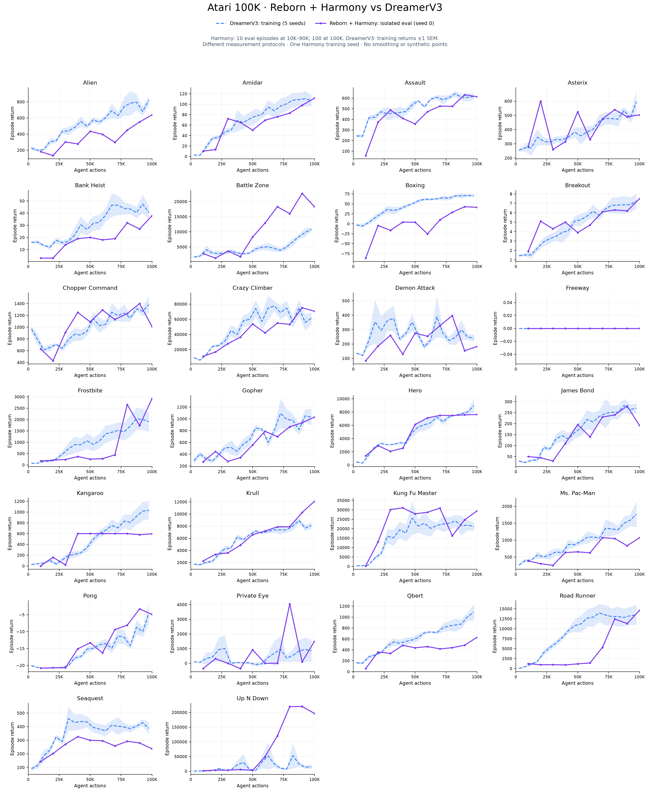

# Harmony vs DreamerV3 — toàn bộ 26 game Atari

[PDF tổng quan](all_games_overview.pdf)

Đường **tím**: Reborn + Harmony, training seed 0, evaluation riêng mỗi checkpoint; 10 episode tại 10K–90K và 100 episode tại 100K. Đường **xanh đứt**: DreamerV3 training returns từ W&B đã lưu, aggregate 5 seed theo bin 5K; dải ±1 SEM giữa seed.

**Hai đường khác loại phép đo; đây là reference comparison, không phải matched evaluation.** Không dùng bảng này để tuyên bố thắng/thua baseline theo cùng protocol. Harmony một seed không có dải bất định giữa training seed. Không smoothing, không thêm điểm 0, không lấy training score lấp evaluation. Nối thẳng các checkpoint chỉ để hiển thị.

Bốn game Boxing/Up N Down/Frostbite/Road Runner lấy từ screening job 3897; 22 game còn lại từ job 3997, cùng cấu hình Harmony. Đủ 260 điểm và 4.940 episode. Nguồn/hash và quy ước vẽ nằm trong [metadata](plot_metadata.json).

| Game | Final Harmony (100 episodes) | PNG | PDF |
|---|---:|---|---|
| Alien | 637.80 | [PNG](png/alien.png) | [PDF](pdf/alien.pdf) |
| Amidar | 111.76 | [PNG](png/amidar.png) | [PDF](pdf/amidar.pdf) |
| Assault | 613.62 | [PNG](png/assault.png) | [PDF](pdf/assault.pdf) |
| Asterix | 504.00 | [PNG](png/asterix.png) | [PDF](pdf/asterix.pdf) |
| Bank Heist | 37.80 | [PNG](png/bank_heist.png) | [PDF](pdf/bank_heist.pdf) |
| Battle Zone | 18,290.00 | [PNG](png/battle_zone.png) | [PDF](pdf/battle_zone.pdf) |
| Boxing | 41.39 | [PNG](png/boxing.png) | [PDF](pdf/boxing.pdf) |
| Breakout | 7.49 | [PNG](png/breakout.png) | [PDF](pdf/breakout.pdf) |
| Chopper Command | 1,012.00 | [PNG](png/chopper_command.png) | [PDF](pdf/chopper_command.pdf) |
| Crazy Climber | 70,558.00 | [PNG](png/crazy_climber.png) | [PDF](pdf/crazy_climber.pdf) |
| Demon Attack | 182.55 | [PNG](png/demon_attack.png) | [PDF](pdf/demon_attack.pdf) |
| Freeway | 0.00 | [PNG](png/freeway.png) | [PDF](pdf/freeway.pdf) |
| Frostbite | 2,921.40 | [PNG](png/frostbite.png) | [PDF](pdf/frostbite.pdf) |
| Gopher | 1,029.20 | [PNG](png/gopher.png) | [PDF](pdf/gopher.pdf) |
| Hero | 7,626.60 | [PNG](png/hero.png) | [PDF](pdf/hero.pdf) |
| James Bond | 191.50 | [PNG](png/jamesbond.png) | [PDF](pdf/jamesbond.pdf) |
| Kangaroo | 596.00 | [PNG](png/kangaroo.png) | [PDF](pdf/kangaroo.pdf) |
| Krull | 12,106.60 | [PNG](png/krull.png) | [PDF](pdf/krull.pdf) |
| Kung Fu Master | 29,438.00 | [PNG](png/kung_fu_master.png) | [PDF](pdf/kung_fu_master.pdf) |
| Ms. Pac-Man | 1,072.20 | [PNG](png/ms_pacman.png) | [PDF](pdf/ms_pacman.pdf) |
| Pong | -4.91 | [PNG](png/pong.png) | [PDF](pdf/pong.pdf) |
| Private Eye | 1,496.79 | [PNG](png/private_eye.png) | [PDF](pdf/private_eye.pdf) |
| Qbert | 630.00 | [PNG](png/qbert.png) | [PDF](pdf/qbert.pdf) |
| Road Runner | 14,620.00 | [PNG](png/road_runner.png) | [PDF](pdf/road_runner.pdf) |
| Seaquest | 237.20 | [PNG](png/seaquest.png) | [PDF](pdf/seaquest.pdf) |
| Up N Down | 196,432.50 | [PNG](png/up_n_down.png) | [PDF](pdf/up_n_down.pdf) |

[Evaluation CSV](evaluation_summary.csv) · [Episode returns + checkpoint hashes](evaluation_results.json) · [DreamerV3 reference CSV](dreamerv3_training_reference.csv)

Tái tạo: submit `scripts/slurm_harmony26_curves.sh`; script `corewm_eval/harmony26_curves.py`. Chỉ đọc kết quả đã có; không train hoặc evaluation lại, không dùng GPU.
