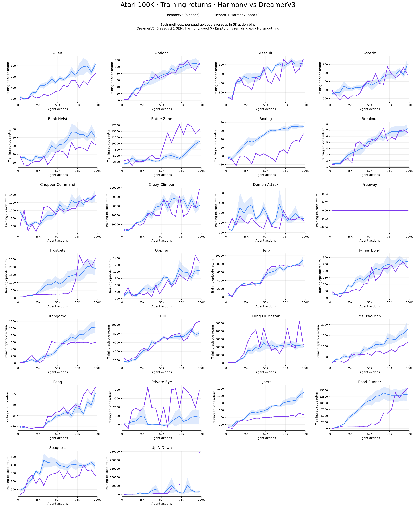

# Harmony vs DreamerV3 — training curves, 26 game

**Up N Down:** [Timeline episode dài và phân tích evaluation](../upndown_long_episode_report/README.md) giải thích các bin trống và phân rã return thành độ dài × reward/action.

[PDF tổng quan](all_games_overview.pdf)

**Cả hai đường đều là training episode return**, gom bin 5K actions theo đúng hàm binning của hình DreamerV3 trước đó. Lấy trung bình episode trong từng bin/từng seed, rồi trung bình giữa seed. DreamerV3: 5 seed, dải ±1 SEM; Harmony: seed 0, không vẽ dải bất định giữa seed. Không EMA smoothing, không dùng evaluation để điền dữ liệu.

Trục x của Harmony dùng agent_actions đã ghi trong episode_scores.jsonl, không ước lượng bằng logger step/4. Bin [0,5K) đặt ở 2.5K; bin cuối [95K,100K] ở97.5K. Episode được gán theo thời điểm kết thúc. Bin không có episode được để trống, không nội suy. Policy sống lâu có thể gây gap; đó không tự động là lỗi logging.

**Đây là so sánh cùng loại metric, không bảo đảm đã khớp mọi cấu hình/model size và số seed.** Điểm cuối là trung bình training trong bin cuối, không phải final evaluation100episode. [Bản evaluation riêng vẫn được giữ](../harmony_vs_dreamerv3_26_learning_curves/README.md).

| Game | PNG | PDF | Bin thiếu (index0–19) |
|---|---|---|---|
| Alien | [PNG](png/alien.png) | [PDF](pdf/alien.pdf) | [] |
| Amidar | [PNG](png/amidar.png) | [PDF](pdf/amidar.pdf) | [] |
| Assault | [PNG](png/assault.png) | [PDF](pdf/assault.pdf) | [] |
| Asterix | [PNG](png/asterix.png) | [PDF](pdf/asterix.pdf) | [] |
| Bank Heist | [PNG](png/bank_heist.png) | [PDF](pdf/bank_heist.pdf) | [] |
| Battle Zone | [PNG](png/battle_zone.png) | [PDF](pdf/battle_zone.pdf) | [] |
| Boxing | [PNG](png/boxing.png) | [PDF](pdf/boxing.pdf) | [] |
| Breakout | [PNG](png/breakout.png) | [PDF](pdf/breakout.pdf) | [] |
| Chopper Command | [PNG](png/chopper_command.png) | [PDF](pdf/chopper_command.pdf) | [] |
| Crazy Climber | [PNG](png/crazy_climber.png) | [PDF](pdf/crazy_climber.pdf) | [] |
| Demon Attack | [PNG](png/demon_attack.png) | [PDF](pdf/demon_attack.pdf) | [] |
| Freeway | [PNG](png/freeway.png) | [PDF](pdf/freeway.pdf) | [] |
| Frostbite | [PNG](png/frostbite.png) | [PDF](pdf/frostbite.pdf) | [] |
| Gopher | [PNG](png/gopher.png) | [PDF](pdf/gopher.pdf) | [] |
| Hero | [PNG](png/hero.png) | [PDF](pdf/hero.pdf) | [] |
| James Bond | [PNG](png/jamesbond.png) | [PDF](pdf/jamesbond.pdf) | [] |
| Kangaroo | [PNG](png/kangaroo.png) | [PDF](pdf/kangaroo.pdf) | [] |
| Krull | [PNG](png/krull.png) | [PDF](pdf/krull.pdf) | [] |
| Kung Fu Master | [PNG](png/kung_fu_master.png) | [PDF](pdf/kung_fu_master.pdf) | [] |
| Ms. Pac-Man | [PNG](png/ms_pacman.png) | [PDF](pdf/ms_pacman.pdf) | [] |
| Pong | [PNG](png/pong.png) | [PDF](pdf/pong.pdf) | [] |
| Private Eye | [PNG](png/private_eye.png) | [PDF](pdf/private_eye.pdf) | [] |
| Qbert | [PNG](png/qbert.png) | [PDF](pdf/qbert.pdf) | [] |
| Road Runner | [PNG](png/road_runner.png) | [PDF](pdf/road_runner.pdf) | [] |
| Seaquest | [PNG](png/seaquest.png) | [PDF](pdf/seaquest.pdf) | [] |
| Up N Down | [PNG](png/up_n_down.png) | [PDF](pdf/up_n_down.pdf) | [13, 15, 16, 17, 18] |

[Aggregate CSV](aggregate.csv) · [Harmony episode rows](harmony_training_episodes.csv) · [Provenance](metadata.json)

Tái tạo bằng scripts/slurm_harmony26_training_curves.sh. Chỉ dựng hình bằng CPU Slurm, không train/eval lại.
