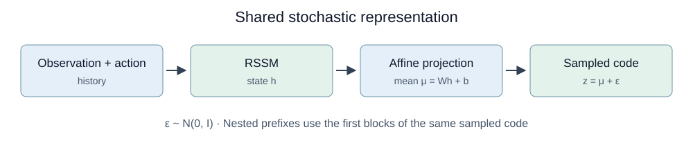
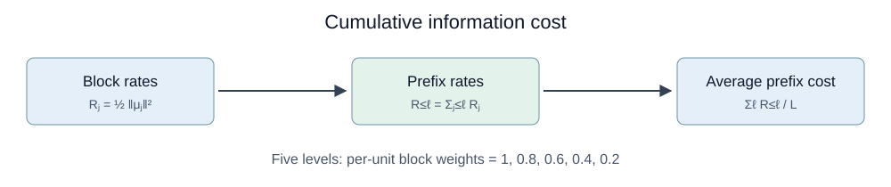
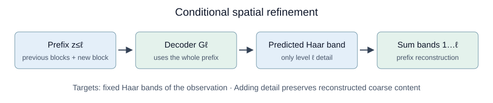
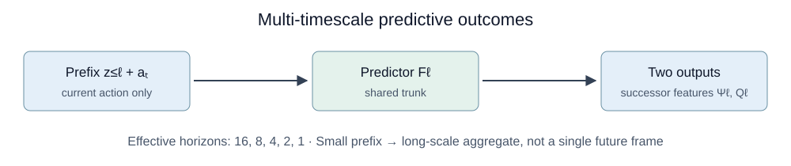
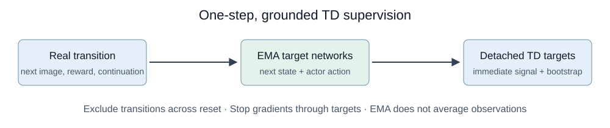
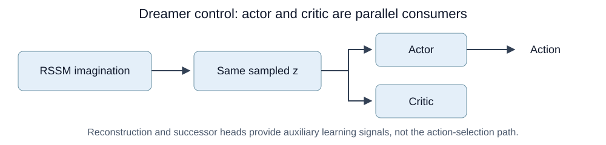

# Các thành phần của CoRe-WM · Reborn

**Ý tưởng:** prefix nhỏ phải giữ thông tin hữu ích cho dự đoán dài hạn; block sau bổ sung chi tiết, đồng thời representation phải trả chi phí thông tin.

Hai panel là **hai objective học đồng thời**, không phải hai giai đoạn pretrain nối tiếp. Hình mô tả thiết kế Reborn; **không thể hiện phần cân bằng loss Harmony**. Các ảnh game là minh họa, không phải kết quả thực nghiệm.

## 1. RSSM và stochastic projection

RSSM tổng hợp lịch sử quan sát–hành động thành trạng thái $h_t$. Projection affine tạo mean, sau đó thêm Gaussian noise:

$$
\mu_t = Wh_t+b, \qquad z_t=\mu_t+\epsilon_t,
\qquad \epsilon_t\sim\mathcal N(0,I).
$$

$z_t$ được chia thành năm block. **Prefix level $\ell$ chứa toàn bộ block từ 1 đến $\ell$**, không chỉ block mới. Noise được dùng thật trên đường projected representation, kể cả khi đánh giá; không chỉ thêm vào auxiliary loss.

## 2. Cumulative rate — chi phí thông tin

Với Gaussian variance cố định, KL của mỗi block bằng:

$$
\mathcal R_j=\tfrac12\|\mu_t^{(j)}\|_2^2,
\qquad
\mathcal L_{\mathrm{rate}}
=\frac{\beta}{L}\sum_{\ell=1}^{L}\sum_{j=1}^{\ell}\mathcal R_j.
$$

Block đầu xuất hiện trong nhiều prefix nên **cùng một đơn vị rate bị tính phí nhiều hơn**. Thông tin chỉ cần cho chi tiết phía sau có động lực được giữ muộn hơn.

Các cột giảm dần trong hình là **trọng số chi phí**, không phải lượng thông tin đo được. Rate là upper bound thông tin của code ngẫu nhiên; không bảo đảm chống collapse khi $\beta$ quá lớn.

## 3. Spatial refinement — tái tạo coarse-to-fine

Observation được phân rã bằng **Haar cố định** thành phần coarse và các dải chi tiết. Mỗi decoder dùng cả prefix để dự đoán đúng dải của mình:

$$
\widehat b_t^{(\ell)}=G_\ell(z_t^{(1:\ell)}),
\qquad
\widehat o_t^{(1:\ell)}
=\sum_{j=1}^{\ell}B_j\widehat b_t^{(j)}.
$$

Block mới được dùng lại context từ block trước. Nhờ các không gian Haar trực giao, **thêm dải chi tiết không ghi đè phần coarse đã tái tạo trong cùng forward pass**.

Các mức ảnh tích lũy là $4,8,16,32,64$. Kích thước dải detail trong hình là lưới hệ số Haar; không phải kích thước ảnh tái tạo tích lũy. Ảnh coarse-to-fine đẹp chưa chứng minh block mới mang thông tin hữu ích: vẫn cần probe cùng target khi có/không có block mới.

## 4. Multi-timescale prediction — dự đoán kết quả tích lũy

Mỗi predictor nhận **prefix và action hiện tại**, xuất hai loại dự đoán:

- $\Psi_\ell$: feature quan sát tương lai được cộng có trọng số, ở độ phân giải của level đó.
- $Q_\ell$: reward tương lai tích lũy theo action, dưới reference policy.

$$
\gamma_\ell=1-1/\Delta_\ell,
\qquad
\Delta=(16,8,4,2,1).
$$

Prefix nhỏ được giao thang thời gian dài; full prefix học next-observation và immediate reward khi $\gamma=0$. Các đường giảm dần là **trọng số discount**, không phải learning curve.

Đây **không phải dự đoán một frame ở endpoint**, cũng không ép latent phải thay đổi chậm. Những frame tương lai trong hình chỉ minh họa nguồn của tổng tích lũy; predictor không xuất cả chuỗi frame. Ký hiệu reward bên cạnh $Q$ là minh họa reward grounding, không phải head reward độc lập thứ ba.

## 5. One-step TD targets — tín hiệu học từ transition thật

Dùng next-observation, reward thật và bootstrap từ target networks:

$$
y^\Psi_\ell=(1-\gamma_\ell)b_{t+1}^{(1:\ell)}
+\gamma_\ell c_{t+1}\bar\Psi_\ell(\bar z_{t+1},a'),
$$

$$
y^Q_\ell=r_{t+1}
+\gamma_\ell c_{t+1}\bar Q_\ell(\bar z_{t+1},a').
$$

$a'$ lấy từ actor hiện tại; predictor dùng prefix tương ứng của $\bar z$. Target projection và predictor cập nhật bằng EMA; **toàn bộ target được detach**. EMA cập nhật tham số mạng, không làm trung bình ảnh hoặc reward.

Loại transition vượt reset; terminal thật có continuation bằng 0. Observation branch dùng squared error; Q branch dùng twohot loss. TD loss thấp chưa đủ: cần đối chiếu với rollout thật dưới policy cố định.

## 6. Dreamer control — học actor và critic

RSSM vẫn là dynamics dùng cho imagination. Actor và critic nhận **cùng sampled representation của mỗi imagined state**, nhưng là hai nhánh song song:

- **Actor:** chọn action.
- **Critic:** ước lượng giá trị để hỗ trợ học policy.

Không đưa ảnh tái tạo hoặc output successor vào đường chọn action. Các head auxiliary định hình representation trong training; không phải chạy chúng để chọn từng action lúc evaluation. Backbone và observation decoder gốc của Dreamer được giữ lại.

## Ghép các thành phần

$$
\mathcal L
=\mathcal L_{\mathrm{WM}}
+\lambda_1\mathcal L_{\mathrm{spatial}}
+\lambda_2\mathcal L_{\mathrm{outcome}}.
$$

Spatial loss gồm distortion Haar và cumulative rate; outcome loss gồm successor-feature và action-value prediction. Công thức là ký hiệu gộp cho hai nhánh auxiliary, không thay thế objective actor–critic gốc.

**Điều cần kiểm chứng:** block mới giảm lỗi dự đoán cùng target, prefix nhỏ dự đoán tốt kết quả dài hạn, và control tốt hơn ở cùng budget. Thiết kế không tự bảo đảm ba điều này.

---

Hình tổng quan được tạo bằng image generation; các sơ đồ từng khối là SVG để dễ đọc trên GitHub. [Prompt và ghi chú hình tổng quan](reborn_two_stage_v1_prompt.md).

