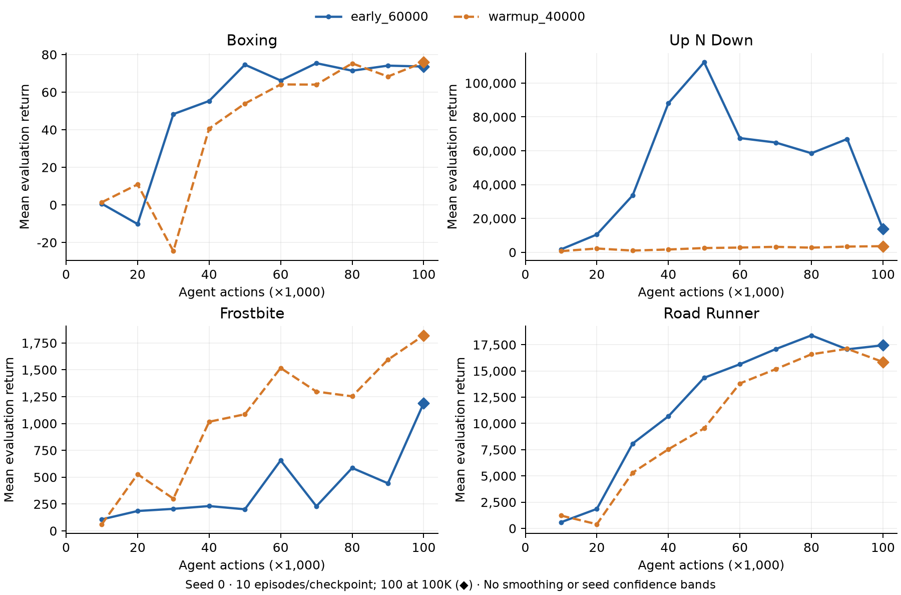

# early_60000

## Ablation thực hiện gì?

Giữ scaffold từ đầu, bật hoặc tắt đồng thời hai auxiliary loss theo executed-action counter hiện tại. Không dùng replay timestamp. Warmup bật khi counter đạt ngưỡng; early tắt khi counter đạt ngưỡng. Thời lượng action danh nghĩa không đồng nghĩa số optimizer updates bằng nhau do prefill/reset.

Đối chứng trực tiếp: **`warmup_40000`** ([thư mục](../warmup_40000/)). Đối chứng bổ sung ngoài các dòng gốc trong Excel.

### Các giá trị khác đối chứng

Bảng lấy từ resolved training config của Boxing; các game dùng cùng thiết lập method. Toàn bộ resolved config của cả bốn game nằm trong `config.csv`.

| Trường | Đối chứng `warmup_40000` | Ablation `early_60000` |
|---|---|---|
| `agent.htp.ablation_stop_actions` | `0` | `60000` |
| `agent.htp.ablation_warmup_actions` | `40000` | `0` |

<details><summary>Overrides đăng ký cho cấu hình này</summary>

```json
{
  "agent.htp.ablation_stop_actions": 60000,
  "agent.htp.enabled": true,
  "agent.htp.grad_to_backbone": false,
  "agent.htp.use_pdyn": true,
  "agent.htp.use_proj": true,
  "agent.htp.use_recon": true,
  "agent.htp.use_vicreg": false,
  "agent.loss_scales.htp_pdyn": 1.0,
  "agent.loss_scales.htp_rec": 1.0
}
```
</details>

### Quy ước các thành phần

- `use_proj/use_recon/use_pdyn`: tạo và dùng projection/reconstruction/prediction; `enabled=false` tắt toàn bộ HTP dù các cờ con vẫn lưu trong config.
- `loss_scales.htp_rec/htp_pdyn`: trọng số loss. Giá trị0 không có nghĩa xóa module.
- `proj.dims/pdyn.dims`: cumulative prefix dimensions, không phải chiều rộng riêng từng block. RSSM h rộng2560; full z rộng2048 mặc định.
- `strides`: số agent actions giữa nguồn và endpoint target, tương ứng theo thứ tự prefix.
- `grad_to_backbone`: gradient của auxiliary vào backbone; không phải cờ tắt mọi gradient từ actor/critic.
- `stop_previous/isolate_previous`: stop-gradient giữa các residual reconstruction / các phần prefix context. `final_only`: chỉ dùng reconstruction loss ở full prefix.
- `slowhtp.rate`: hệ số EMA cập nhật target projection; `ablation_online_target=true` dùng target online đã detach.
- `normalize_valid/mask_resets/zero_actions`: chuẩn hóa cặp hợp lệ / loại cặp vượt reset / zero action input.
- `use_vicreg`: variance penalty của bản Slim, không phải full VICReg. `ablation_raw_readout`: các readout dùng h thay cho z.
- `ablation_warmup_actions/ablation_stop_actions`: mốc bật/tắt auxiliary theo executed-action counter,0 nghĩa là không đặt ngưỡng đó.

## Protocol và cách tính

CoRe-WM gốc commit `5ee4f27a0ba7fd7bdbdcbd4823fb2d539f8b4b47`, size12m, không Harmony/persistence/isotropy trong full. Các hook ablation và logging bổ sung được mô tả trong protocol ở thư mục cha. Bốn game: Boxing, Up N Down, Frostbite, Road Runner; **một training seed:0**. 100,000 executed agent actions, action repeat4, replay ratio256, batch16×64. Environment seeding bật cho toàn bộ sweep mới; không dùng run năm seed cũ làm paired control.

Evaluate frozen checkpoints tại10K,20K,…,100K:10 episodes/mốc trung gian; **100 episodes ở checkpoint cuối**. Điểm cuối không chọn theo max return. `mean_return` là trung bình raw episode returns; `episode_sd` là sample SD của100 episode (`ddof=1`), **không phải SD qua training seeds**. HNS = (mean_return − random_reference)/(human_reference − random_reference), đơn vị ratio, không clip. Episode length giữ nguyên cách đếm của logger gốc (gồm reset callback).

## Các file

| File | Nội dung |
|---|---|
| `results.csv` | Final returns, episode SD, HNS và references của ablation và đối chứng; tám dòng, bốn game mỗi method |
| `learning_curves.csv` | Điểm eval ở10 checkpoint, số episodes và seed; 80 dòng |
| `episodes.csv` | Raw return và length từng eval episode, cả hai method; 1,520 dòng |
| `config.csv` | Resolved config theo method/game; giá trị lưu dạng JSON |
| `provenance.csv` | Hash checkpoint100K, resolved config, episode ledger và source run tương đối |
| `plot.py` | Đọc duy nhất `learning_curves.csv` và `results.csv` cạnh script, vẽ bốn panel và đánh dấu final checkpoint |
| `learning_curves.png`, `learning_curves.pdf` | Figure cùng dữ liệu, không smoothing và không có confidence band qua seeds |

## Vẽ lại

```bash
python -m pip install 'matplotlib>=3.8,<4'
python plot.py
```

Cũng có thể gọi script bằng đường dẫn từ bất kỳ working directory nào. Output ghi cạnh script. Không cần JAX, GPU, checkpoint, training repository hoặc truy cập mạng để vẽ; chỉ cần Python3 và Matplotlib đã cài. Script kiểm tra đủ10 checkpoint và final point khớp `results.csv`. Không đọc folder đối chứng, JSON hoặc dữ liệu ở ngoài folder này.



## Phạm vi phép đo

Đây là single-seed ablation trên bốn game, không phải Atari26 aggregate hoặc kết luận về seed robustness. Các thay đổi width, level, xóa head hoặc readout có thể thay parameter count/RNG; không coi chúng là capacity-matched. README chỉ mô tả thiết lập và artifact, không diễn giải hay xếp hạng kết quả.
