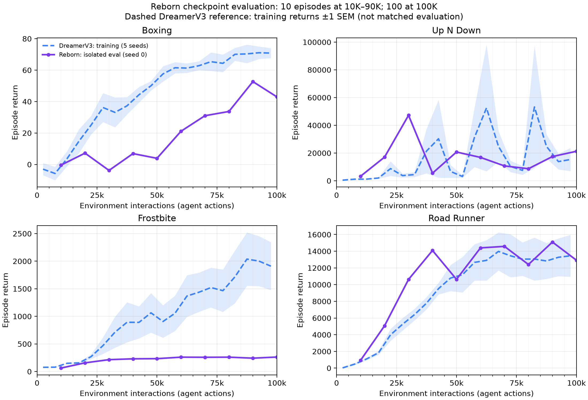

# Reborn: evaluation riêng theo checkpoint

Protocol lấy từ `corewm_eval/full_policy_stage.py`: eval seed 0, một environment,
10 episode tại mỗi checkpoint 10K–90K và 100 episode tại 100K. Bốn game dùng
training seed 0. Load checkpoint bằng source đóng băng của run; không train lại.
SHA256 checkpoint được kiểm tra trước và sau evaluation. Noise Reborn vẫn bật
đúng cấu hình đã train, policy dùng mode eval.

Đường tím là evaluation riêng tại từng checkpoint. Đường xanh đứt là training
returns DreamerV3 5 seed từ dữ liệu W&B đã có trong repo, dải ±1 SEM giữa seed.
Đây chưa phải so sánh hai phương pháp bằng cùng protocol evaluation; không có
checkpoint DreamerV3 tương ứng được sử dụng trong báo cáo này. Lịch evaluation
trên là protocol CoRe-WM đã áp dụng trong repo, không phải tuyên bố mọi thiết
lập đều trùng evaluation chính thức của DreamerV3. Reborn một training seed
không có dải bất định giữa training seed. Không dùng training score để lấp
điểm evaluation.

| Game | Mean final evaluation (100 episodes) |
|---|---:|
| Boxing | 42.98 |
| Up N Down | 21,285.90 |
| Frostbite | 262.20 |
| Road Runner | 12,922.00 |

Điểm final này thay thế ước lượng 20 episode trước cho báo cáo mới; dữ liệu cũ
được giữ trong `../reborn_four_game_results/` để truy xuất. JSON chứa từng
episode return và checkpoint hash; CSV chứa đủ 40 điểm evaluation.

Implementation: `corewm_eval/reborn_checkpoint_eval.py` chạy và kiểm tra số
episode/hash; `corewm_eval/reborn_checkpoint_report.py` tổng hợp và vẽ.
