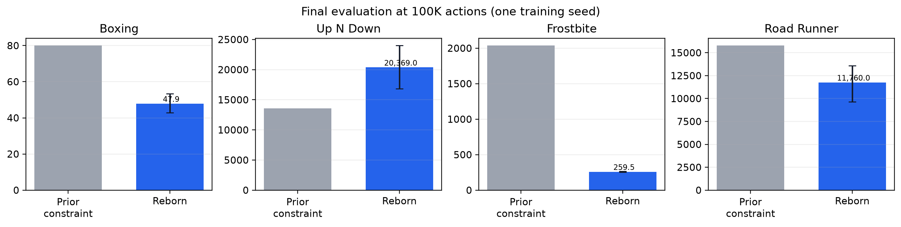
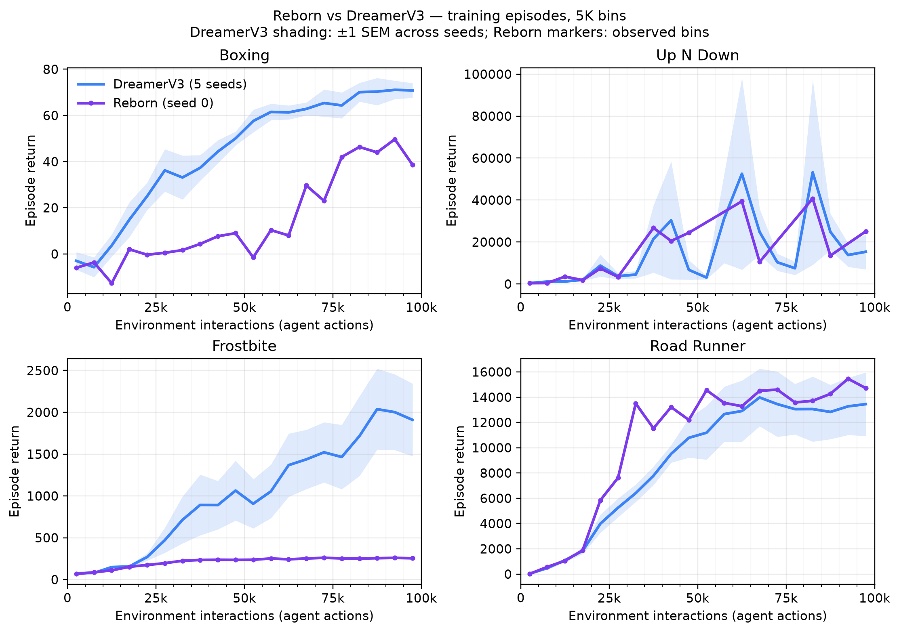
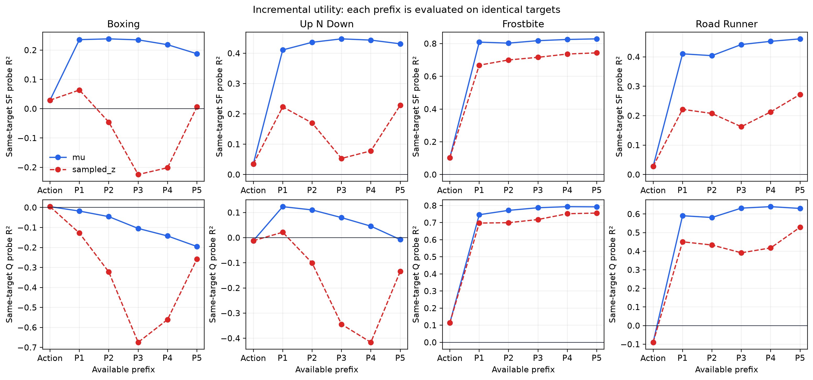
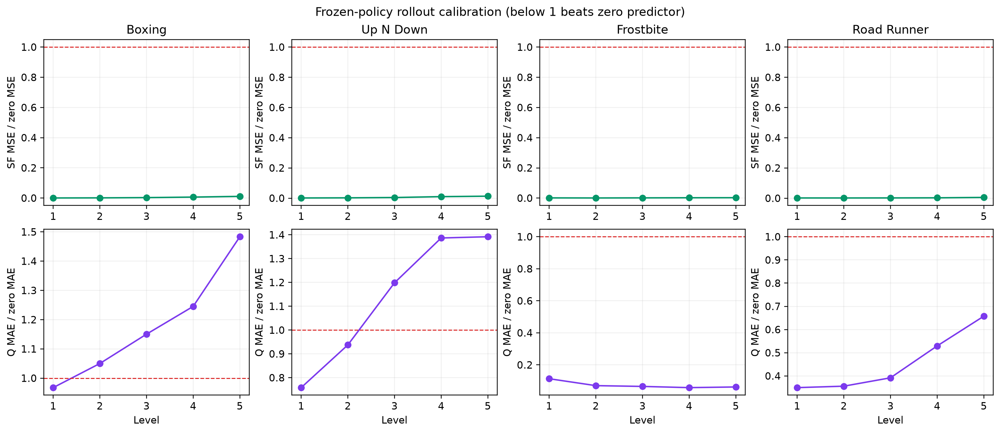
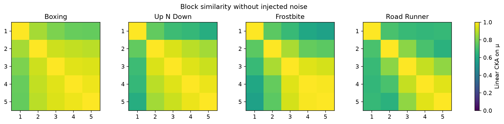

# Kết quả screening Reborn trên bốn game Atari 100K

**Cập nhật:** đã có [evaluation riêng đủ 10 checkpoint và 100 episode cuối](../reborn_checkpoint_evaluation/RESULTS_VI.md),
kèm [biểu đồ mới](../reborn_checkpoint_evaluation/learning_curves.png).
Báo cáo bên dưới giữ kết quả screening 20 episode và đường training cũ để truy xuất.

Job 3846 hoàn thành thành công trên hai H200 trong 1 giờ 09 phút. Mỗi game được
train từ đầu với seed 0 và 100.000 environment actions, sau đó chạy 20 episode
evaluation seed 0. Khoảng tin cậy dưới đây bootstrap **episode evaluation**, nên
không đại diện cho bất định giữa các training seed.

| Game | Reborn | 95% CI episode | constrained-full cũ | Chênh lệch |
|---|---:|---:|---:|---:|
| Boxing | 47.9 | [42.9, 53.4] | 80.0 | -32.1 |
| Up N Down | 20,369.0 | [16,815.0, 24,006.0] | 13,565.0 | +6,804.0 |
| Frostbite | 259.5 | [251.5, 268.0] | 2,038.0 | -1,778.5 |
| Road Runner | 11,760.0 | [9,639.9, 13,590.0] | 15,790.0 | -4,030.0 |

Kết quả control không cho thấy cải thiện đồng đều. Up N Down tăng 6.804 điểm
so với constrained-full screening cùng seed/budget. Boxing giảm 32,15 điểm,
Road Runner giảm 4.030 điểm, và Frostbite giảm 1.778,5 điểm. Hai run dùng cùng
100K action và seed 0, nhưng kiến trúc, số parameter và objective khác nhau;
đây là comparison định hướng, chưa phải paired causal estimate.

Đường học đã đổi sang so sánh **Reborn với DreamerV3**, theo layout của
`full_vs_dreamerv3_constraint_suite_learning_curves`: trung bình episode trong
bin 5K action, đặt điểm tại tâm bin. DreamerV3 dùng 5 seed với dải ±1 SEM;
Reborn dùng seed 0, không có dải bất định. Cả hai đường là training episode
returns. Bảng final evaluation ở trên vẫn là đối chiếu constraint lịch sử,
không phải final evaluation DreamerV3.

Hình cũ bị đứt vì bin 10K không có episode kết thúc được ghi `null`, chuyển
thành NaN khi vẽ. Hình mới nối thẳng các bin có dữ liệu, không điền score vào
bin trống hoặc ngoại suy ra đầu/cuối budget. Marker tím chỉ bin có quan sát.
Trục X Reborn lấy trực tiếp `agent_actions` trong `episode_scores.jsonl`, tránh
sai lệch do reset callback trong logger step. Dữ liệu và nguồn được lưu trong
`learning_curve_aggregate.csv`, `learning_curve_episode_rows.csv` và
`learning_curve_metadata.json`; từng game có PNG/PDF `learning_curve_<game>`.

Reborn có 49,36M trainable parameters so với 40,60M của constrained CoRe-WM.
Vì vậy kết quả không parameter-matched. Training episode curve mô tả hành vi
trong lúc policy thay đổi và chỉ dùng để tìm thời điểm học; final evaluation
mới là control endpoint chính.

## Representation và predictive outcomes

Probe dùng split theo episode và chấm mọi prefix trên cùng target. Frostbite và
Road Runner có incremental utility rõ trên cả mean code và sampled code.
Up N Down có tín hiệu tốt trên mean code nhưng noise làm giảm mạnh lợi ích của
prefix lớn. Boxing yếu nhất: sampled-code probe nhìn chung không hơn action-only.
Điều này cho thấy `mu` không collapse nhưng fixed unit noise có thể làm giảm
usable information khi signal-to-noise ratio thấp.

SF head thắng zero predictor rất rõ trên cả bốn game. Q head thắng zero rõ ở
Frostbite và Road Runner; ở Boxing và Up N Down, các horizon ngắn/prefix lớn có
tỉ lệ lỗi lớn hơn 1. TD objective vì vậy chưa tạo Q calibration đồng đều. Đây
là failure cụ thể cần tách bằng ablation `no_q`, scale Q và stochastic noise.

Mean off-diagonal CKA vẫn cao: Boxing 0,881; Up N Down 0,828; Frostbite 0,784;
Road Runner 0,760. Fixed Haar target và cumulative rate chưa đủ tạo block độc
lập. Tuy vậy CKA cao không phủ định incremental utility: Frostbite/Road Runner
vẫn cải thiện probe khi thêm prefix. Tiêu chí chính là same-target utility,
không phải ép CKA về zero.

## Chẩn đoán giả thuyết

- H1 được ủng hộ một phần: detail reconstruction và same-target utility rõ ở
  Frostbite/Road Runner, yếu hoặc bị noise phá ở Boxing/Up N Down.
- H2 được ủng hộ cho SF; Q chỉ được ủng hộ ở hai game. Bootstrap TD loss nhỏ
  không đủ dự đoán rollout calibration.
- H3: không thấy collapse theo dead-coordinate/variance của `mu`, nhưng effective
  rank chỉ khoảng 4–10 và sampled probes cho thấy bottleneck có thể quá mạnh.
- H4 bị bác bỏ ở screening hiện tại: control giảm ở 3/4 game, dù representation
  metrics ở Frostbite rất tốt. Representation target fit chưa đủ bảo đảm control.

Failure ưu tiên tiếp theo là đường stochastic code và Q grounding. Vòng ablation
hợp lý nhất giữ mọi thứ cố định và thay một yếu tố: `deterministic` so với full
trên Boxing/Frostbite, vì hai game phân biệt được trường hợp sampled utility yếu
và trường hợp representation tốt nhưng control xấu. Sau đó mới xét `no_q` hoặc
giảm kích thước head để tách gradient conflict và parameter-count confound.

## Artifact và giới hạn

`summary.json` chứa toàn bộ score, CI, probe, calibration và learning-curve bins;
`summary.csv` là bảng compact. Diagnostic dùng 30 frozen-policy clips, horizon
128 và episode-held-out ridge probes. Clip bắt đầu từ reset và episode variation
không thay thế nhiều training seeds. Một outlier thấp xuất hiện trong Road Runner
evaluation, nên cần thêm seed trước khi kết luận ranking.
