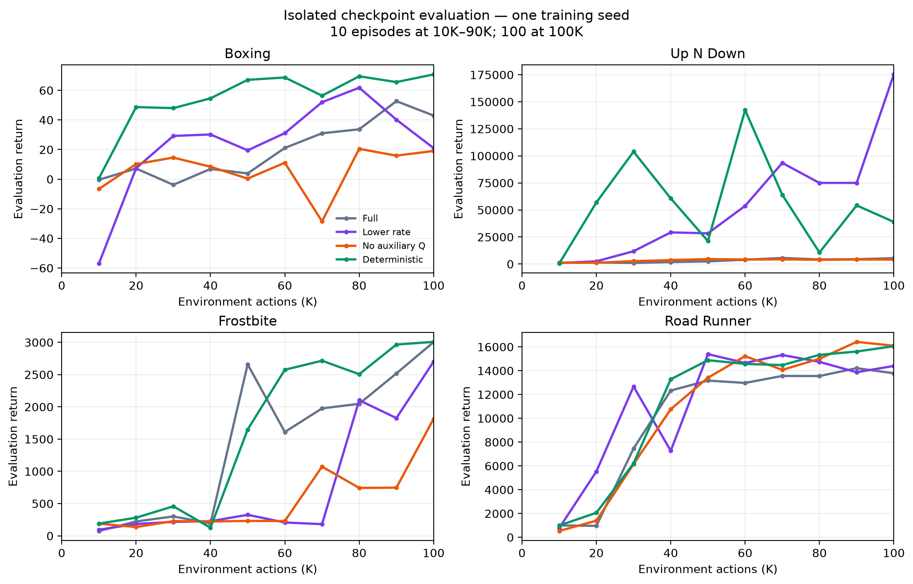
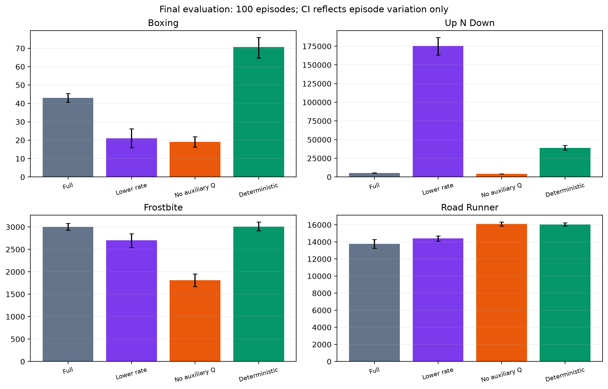
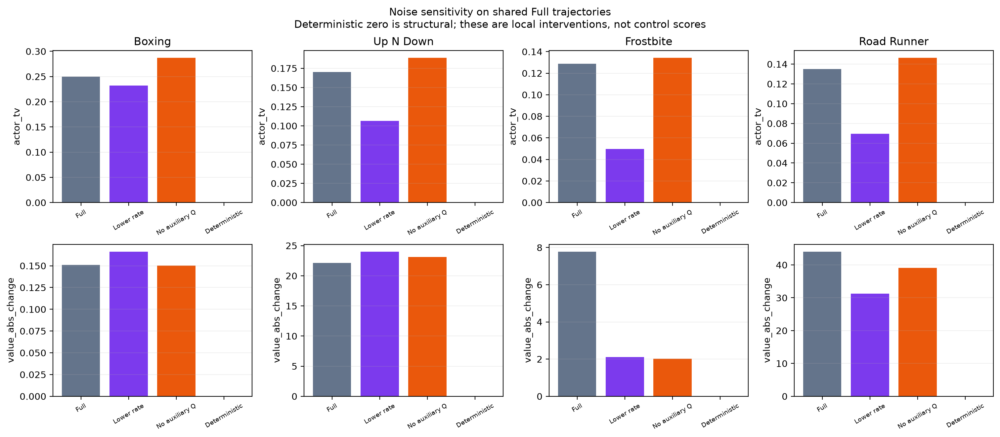
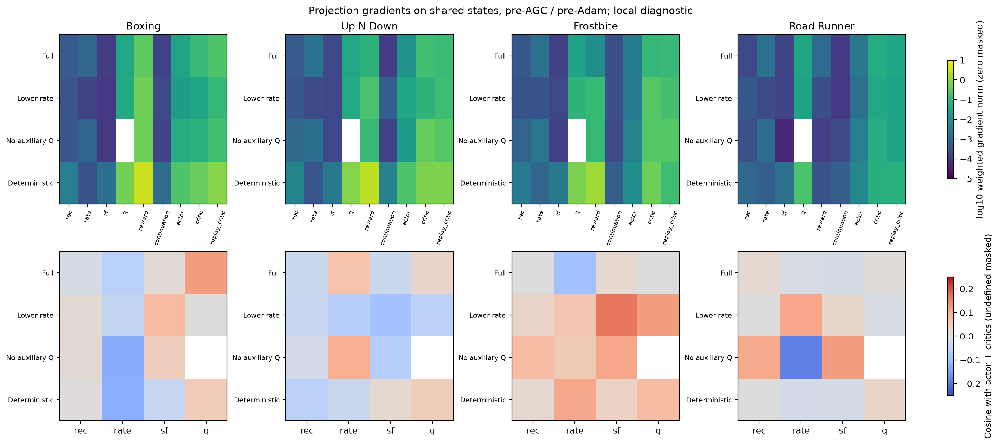

# Reborn: kết quả hoàn tất bốn ablation

Job 3854 hoàn tất: 16 run × 100K actions, 160 điểm checkpoint evaluation,
3.040 episode evaluation. Mỗi arm chỉ có training seed 0. Final score dùng
100 episode; 10K–90K dùng 10 episode/checkpoint. CI bootstrap episode không
phải bất định giữa training seed. Tất cả stage diagnostic/audit đã hoàn tất.

| Game | Full | Giảm beta 10× | Bỏ Q | Bỏ noise |
|---|---:|---:|---:|---:|
| boxing | 42.98 | 21.03 | 19.05 | 70.75 |
| up_n_down | 5,424.50 | 175,267.80 | 4,152.40 | 38,945.70 |
| frostbite | 3,003.30 | 2,700.30 | 1,813.00 | 3,007.20 |
| road_runner | 13,783.00 | 14,399.00 | 16,095.00 | 16,058.00 |

## Up N Down: kết quả cuối và cập nhật giả thuyết

Deterministic đạt **38.945,7**, median **37.805**, range **7.240–82.270** trên
100 episode: tốt hơn Full **5.424,5** khoảng **7,18×**, nhưng thấp hơn low_rate
**175.267,8** khoảng **4,50×**. Low_rate median **186.550**, range
**55.040–251.020**: lợi ích không đến từ một outlier duy nhất.

Deterministic đã lên **103.929 ở 30K**, **142.337 ở 60K**, rồi tụt **10.722 ở
80K**. Vì vậy bỏ noise giúp policy học sớm nhưng chưa xử lý ổn định theo thời
gian; các điểm trung gian chỉ có 10 episode nên vẫn chứa evaluation variance.
Low_rate thắng final rõ trong run này; cần so AUC và nhiều training seed trước
khi chọn cấu hình. AUC trung bình 10K–100K lưu trong summary.csv, không ngoại
suy về 0 actions và không gọi đây là HNS AUC.

AUC trung bình Up N Down: Full **3.157,7**, low_rate **50.817,4**, no_Q
**3.492,5**, deterministic **59.306,5**. Bỏ noise tốt hơn low_rate về diện tích
đường học trong lần chạy này, dù thấp hơn rõ ở final: xếp hạng phụ thuộc vào
sample efficiency hay endpoint. Đây không phải bằng chứng low_rate thống trị
toàn bộ quá trình học.

Auxiliary Q rollout MAE/zero-MAE ở deterministic là khoảng
**[0,554; 0,713; 0,953; 1,211; 1,363]**. Ba horizon dài tốt hơn zero, hai horizon
ngắn vẫn kém zero theo MAE. Bỏ noise chưa tự sửa Q calibration. Không suy
từ zero noise sensitivity ở deterministic thành bằng chứng control tốt: giá
trị đó bằng zero theo kiến trúc.

## Kết luận theo giả thuyết

- **Rate quá mạnh:** được ủng hộ ở Up N Down và một phần Road Runner. Boxing
  giảm final dù học tốt hơn ở một số checkpoint; Frostbite học chậm hơn. Giảm
  rate không phải cải thiện phổ quát. Mu/probe trên trajectory riêng không
  cùng phân phối nên không dùng để chứng minh SNR tăng trên mọi game.
- **Q gây hại chung:** không được ủng hộ. No-Q thua Full ở Boxing, Up N Down,
  Frostbite, chỉ thắng Road Runner. Gradient Q không có cosine âm nhất quán
  với actor–critic. Nên giữ grounding reward, kiểm tra trọng số thay vì bỏ Q
  toàn bộ. Q-head không được supervise ở no-Q nên không chấm nó như head học.
- **Noise gây khó control:** được ủng hộ mạnh nhất ở Boxing (42,98 → 70,75)
  và được hỗ trợ bởi Up N Down/Road Runner. Frostbite gần như không thay đổi
  final. Deterministic bỏ diễn giải stochastic information bound; đây là
  ablation chẩn đoán, không tự là phương pháp cuối.

Giảm beta hạ actor TV khi resample noise trên cùng Full trajectories:
Boxing 0,249 → 0,232; Up N Down 0,170 → 0,107; Frostbite 0,129 → 0,050;
Road Runner 0,135 → 0,070. Actor ít nhạy noise hơn chưa đủ đảm bảo score tăng.

Audit dùng cùng ba episode prefix (tối đa 64 state), hai PRNG replicate;
norm/cosine trước AGC/Adam, không phải optimizer update thực tế. Gradient
reward/critic trên projection có thể lớn hơn Q. Reconstruction gradient nhỏ
ở checkpoint cuối không chứng minh nó vô ích lúc đầu. Coarse-to-fine là tính
chất output Haar; chưa cô lập nhân quả đóng góp reconstruction trong vòng này.

## Giới hạn và hướng nghiên cứu tiếp

Full chạy lại khác lần Reborn đầu ở ba game dù cùng seed; Boxing tái hiện
đúng. So sánh source model chỉ thấy bổ sung metric trong hai file Reborn,
nhưng nguyên nhân phân kỳ chưa xác định. Không kết luận rằng instrumentation
hoàn toàn vô ảnh hưởng tới số học/scheduling. Cần audit reproducibility và
thêm training seed cho hướng low_rate/deterministic có lợi.

Critic complete-return calibration chỉ hợp lệ trên clip terminal thật, không
dùng return cắt ngắn như target chính xác. Coverage khác nhau giữa policy;
không so raw critic MAE giữa game hoặc phân phối khác như một causal metric.
Shared-state audit chỉ đo gradient và reliance, không on-policy calibration.

Ưu tiên tiếp: xác nhận rate–noise tradeoff và policy degradation cuối training,
giữ Q làm mặc định; không thêm regularizer mới chỉ vì CKA hoặc probe chưa đẹp.

## Dữ liệu và implementation

`evaluation_results.json`: từng episode return, checkpoint hash, seed và arm.
`summary.csv`: final mean/median, episode CI, range và normalized-by-duration AUC.
`shared_state_audits.json`: gradient/intervention đầy đủ trên shared states.
`diagnostics.json`: probes, CKA, calibration, episode coverage cho từng arm/game.
`provenance.json`: source SHA256, manifest job, test output (9 passed).

Protocol: [REBORN_HYPOTHESIS_SUITE_VI.md](../persistence_research/REBORN_HYPOTHESIS_SUITE_VI.md).
Runner: `corewm_eval/reborn_hypothesis_suite.py`; audit:
`corewm_eval/reborn_actor_audit.py`; report: `corewm_eval/reborn_hypothesis_report.py`.
