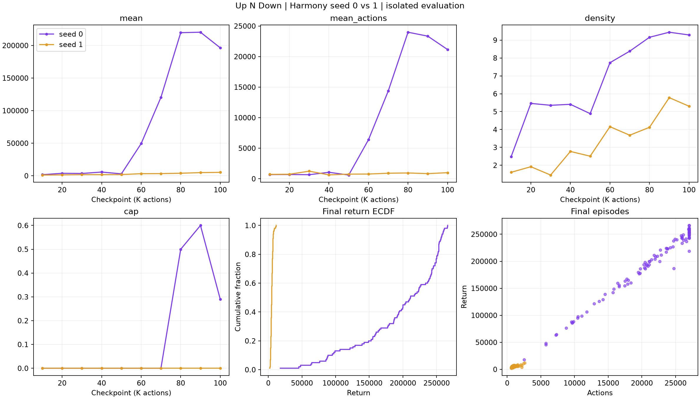
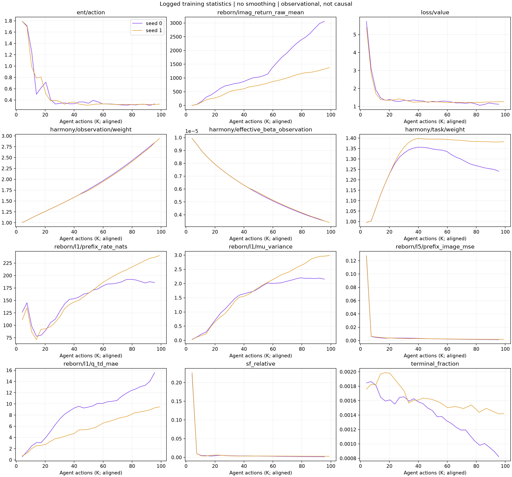

# Up N Down: vì sao Harmony seed 0 và seed 1 chênh 37 lần?

## Kết luận ngắn

**Khác biệt trực tiếp đo được là khả năng duy trì episode dài, không phải chỉ kiếm
điểm nhanh hơn. Nguyên nhân học dẫn tới khác biệt đó chưa được xác định nhân quả.**
Hypothesis phù hợp nhất với log: khác biệt khám phá/khởi tạo dẫn tới trajectory
training khác nhau; khoảng 55K–60K seed 0 đạt một chế độ policy sống lâu hơn,
sau đó có thể được củng cố bởi replay và actor–critic. Seed 1 cải thiện điểm/action
nhưng không đạt chuyển biến survival tương tự trong 100K. Chưa biết kỹ năng cụ thể
là tránh va chạm, timing hay một hành vi khác vì chưa phân tích action/video/RAM.

EDA chỉ đọc dữ liệu, chạy CPU Slurm job 4202; không thay model, không submit GPU,
không tác động replication job 4080. Không dùng seed 0 làm bằng chứng method chắc chắn tốt.

## 1. Audit trước khi diễn giải

- So toàn bộ saved training config: chỉ khác `seed` (0/1) và `logdir`.
- SHA256 giống nhau cho `reborn.py`, `agent_reborn.py`, `agent_htp.py`,
  `configs.yaml`, `embodied/envs/atari.py` trong frozen snapshots.
- Cùng final budget 100K và 100 eval episodes; checkpoint trung gian 10 episodes.
- Cùng evaluation RNG seed 0; training seed khác tác động đồng thời initialization,
  policy sampling, replay/environment RNG, nên không cô lập được nguồn randomness nào.
- Git HEAD trong logger có thể khác do repo cha; không phải bằng chứng code model khác.
- Đây là audit các file chính và config, không phải bảo đảm bitwise hardware/runtime equivalence.

[Audit JSON](audit.json) chứa config differences và hashes.

## 2. Chênh lệch return nằm ở đâu?

| Final evaluation (100 episodes) | Seed 0 | Seed 1 |
|---|---:|---:|
| Mean return | 196432.5 | 5279.3 |
| Median return | 211230 | 5155 |
| P10 return | 94411 | 3397 |
| P90 return | 255604 | 7034 |
| Mean episode actions | 21152.46 | 995.37 |
| Pooled reward/action | 9.2865 | 5.3039 |
| Episodes dài đúng 27000 actions | 29/100 | 0/100 |

Với A là số actions trong episode, định nghĩa density = tổng return / tổng A:

$$\overline R = \overline A\,\frac{\sum_e R_e}{\sum_e A_e}.$$

Do đó tỷ số mean return giữa hai run là **37.208 = 21.251 × 1.751**.
Đây là đẳng thức mô tả, không phân rã causal effects độc lập. Reward density có thể
đổi do gặp giai đoạn/trạng thái game khác nhau. Episode length đo thời lượng chơi,
không phải log lives/collision; không quy đổi thành xác suất sống mỗi action nếu
không có giả định hazard phù hợp.

P10 seed 0 còn cao hơn P90 seed 1 rất nhiều: khác biệt không chỉ do một episode
may mắn kéo mean lên. Tuy nhiên 100 episodes vẫn chỉ đánh giá một trained policy/seed.
27K là proxy cap; log không xác nhận termination cause, có thể trùng game-over.

## 3. Hai run tách nhau lúc nào?

| Checkpoint | Return seed 0 / seed 1 | Mean actions seed 0 / seed 1 |
|---|---:|---:|
| 20K | 3804 / 1422 | 696.7 / 740.7 |
| 40K | 5727 / 1755 | 1058.8 / 632.5 |
| 50K | 2979 / 1901 | 609.5 / 757.8 |
| 60K | 49392 / 3209 | 6385.6 / 771.6 |
| 80K | 219651 / 3910 | 23987.8 / 948.6 |
| 100K | 196432.5 / 5279.3 | 21152.46 / 995.37 |

Seed 0 đã có density cao hơn từ 20K dù length gần seed 1. Tại 50K nó vẫn chưa có
long-episode performance ổn định, nên không phải cứ seed 0 là tốt ở mọi thời điểm.
Giữa 50K và 60K: mean episode actions seed 0 tăng khoảng 10.5 lần; seed 1 gần như không đổi.

Training episode log xác nhận chuyển biến không chỉ có trong evaluation:

- Seed 0: episode từ action **55136 đến 61029**, length **5893**, return **45830**.
- Tiếp theo length **3519**, return **23990**; rồi length **7726**, return **60540**.
- Episode từ **72274 đến 97236** kéo dài **24962** actions, return **242470**.
- Seed 1 quanh 55K–65K vẫn chủ yếu vài trăm đến khoảng 1100 actions/episode.

Training policy tiếp tục cập nhật bên trong các episode; không coi episode dài đó
là kết quả của một fixed checkpoint. Fixed checkpoint evaluation 60K trở đi mới
xác nhận policy đã cải thiện. Thời điểm khởi phát chính xác cần checkpoint dày hơn
hoặc trajectory audit, không thể nội suy từ khoảng eval 10K.

## 4. Loss và representation có giải thích được không?

Các số dưới đây là trung bình log trong cửa sổ **80K–100K**, không phải held-out metrics:

| Tín hiệu | Seed 0 | Seed 1 |
|---|---:|---:|
| Harmony observation weight | 2.669 | 2.712 |
| Harmony task weight | 1.253 | 1.382 |
| Prefix-1 rate (nats) | 187.56 | 231.70 |
| Prefix-1 mu variance | 2.178 | 2.895 |
| Full-prefix image MSE | 0.001528 | 0.001864 |
| Action entropy | 0.3206 | 0.3240 |
| Value loss | 1.129 | 1.253 |
| Imagined return raw mean | 2792.6 | 1274.8 |
| Prefix-1 Q TD MAE | 13.73 | 8.95 |
| Prefix-1 SF error / zero-target baseline | 0.00200 | 0.00300 |
| Replay valid-transition terminal fraction | 0.000932 | 0.001443 |

**Beta:** explicit beta là 1e-5 ở cả hai run. Relative beta so với observation
group là beta/weight, cùng khoảng 3.7e-6 ở cuối. 40K–60K observation weights cũng
gần nhau (1.770 vs 1.738), prefix-1 rate 165.74 vs 162.57, mu variance 1.832 vs 1.819,
full image MSE đều khoảng 0.002710. Không thấy bằng chứng seed 1 bị phạt rate mạnh
hơn đủ để giải thích thất bại. Cuối run, seed 1 còn dùng rate và variance cao hơn.

Điều này **không bác bỏ tác dụng beta khi ablate beta**, nhưng bác bỏ lời giải thích
đơn giản rằng hai run này khác nhau vì đã chạy hai beta khác nhau. Muốn biết
beta có tăng xác suất đạt chế độ tốt không phải có matched multi-seed beta ablation.

**Reconstruction:** cả hai học được reconstruction loss thấp; tương đồng trước
điểm tách nhưng control rất khác. Tái tạo tốt không đủ chứng minh representation
giữ đúng thông tin cần cho quyết định tránh chết. Các loss này chấm trên replay
khác nhau, chưa phải common-state test nên không xếp hạng chất lượng representation
chỉ dựa vào MSE.

**Collapse:** variance của mu khác 0 và rate không mất đi không phù hợp với collapse
toàn cục đơn giản. Nhưng chưa loại được thiếu/collapse task-relevant directions;
không dùng noise covariance làm bằng chứng representation tốt.

**Actor–critic:** entropy cuối gần như giống nhau nên không thấy sự khác biệt lớn
về độ ngẫu nhiên cuối run. Cả hai giảm entropy xuống khoảng 0.3–0.4 từ sớm; đây chỉ
là dấu hiệu phù hợp với khả năng policy ít khám phá, không chứng minh premature
convergence. Cùng entropy không có nghĩa cùng action mapping, state coverage hay kỹ năng.
Imagined return của seed 0 tăng mạnh hơn nhưng là dự đoán của model trên distribution
riêng, không so trực tiếp với full episode return để kết luận critic calibrated.
Value loss thấp và Q TD error thấp hơn ở seed 1 **không chứng minh control tốt hơn**:
target scale/replay khác, TD residual không phải ground-truth control accuracy.

Replay terminal fraction seed 0 giảm theo long episodes là bằng chứng distribution
học khác đi, phù hợp vòng phản hồi policy → replay → model/critic → policy.
Chưa đo trực tiếp occupancy/replay sampling của long trajectories nên không nói
đã chứng minh replay là nguyên nhân. Timeout conflation tồn tại ở cùng env cả hai;
không giải thích riêng khởi phát 55K–60K vì 60K eval chưa có episode chạm cap.

## 5. Giả thuyết được ưu tiên và cách phân biệt

1. **Discovery/coverage khác nhau:** seed 0 tiếp cận và củng cố hành vi giữ episode
   lâu, seed 1 không đạt. Phù hợp timing và length nhưng chưa biết hành vi cụ thể.
2. **Khác chất lượng dự đoán task-relevant trên cùng state:** có thể model/critic
   seed 1 sai ở các tình huống quyết định dù average loss thấp. Chưa được kiểm tra.
3. **Khác nhạy cảm actor với sampled representation:** cùng noise/rate có thể cho
   action mapping khác; log entropy/rate hiện có không đo action consistency.
4. **Beta/Harmony là nguyên nhân trực tiếp:** cấu hình và weights tương tự nên ít
   được ủng hộ như lời giải thích giữa hai seeds, nhưng interactions vẫn có thể tồn tại.

Đối chứng tiếp theo nên dùng frozen checkpoints 50K/60K của cả hai trên **cùng tập
states/trajectory**: action distribution và noise sensitivity, reward/continuation
calibration, MC-return/value error và hành vi game. Nếu policy differences xuất
hiện trên cùng observation mà model errors tương đương, ưu tiên actor/exploration;
nếu model/critic sai tập trung trước failure, ưu tiên learning targets/coverage.
Đây là kế hoạch chẩn đoán, **chưa chạy hoặc submit**. Không swap latent/head giữa hai
seed trực tiếp vì hệ tọa độ representation không được căn chỉnh.

## Dữ liệu và tái tạo

- [Evaluation summary](evaluation_summary.csv), [380 evaluation episodes](evaluation_episodes.csv).
- [Training episodes](training_episodes.csv): seed 0 có 83, seed 1 có 141 completed episodes.
- [Training metrics](training_metrics.csv), [20K window means](metric_windows.csv).
- [Script](../../corewm_eval/upndown_seed_eda.py): chạy module qua CPU Slurm.

Metric timestamp dùng nội suy mapping driver_callbacks×4 → exact agent_actions
từ episode logs, chỉ trong khoảng anchors. Không nội suy returns/gaps; 80K–100K
window thực tế kết thúc ở last completed-episode anchor, khác nhẹ giữa seeds.
Không có CI training variability với hai run đơn lẻ; EDA này không xác lập nhân quả.
