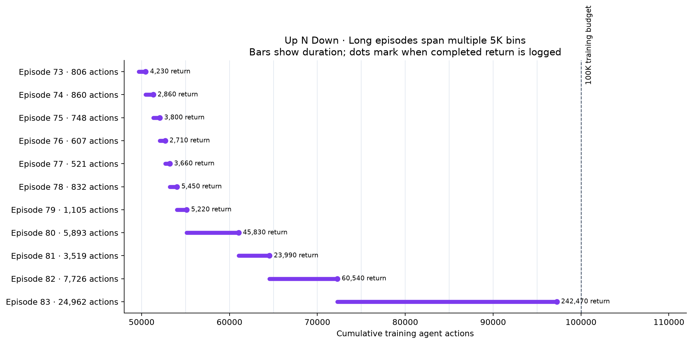
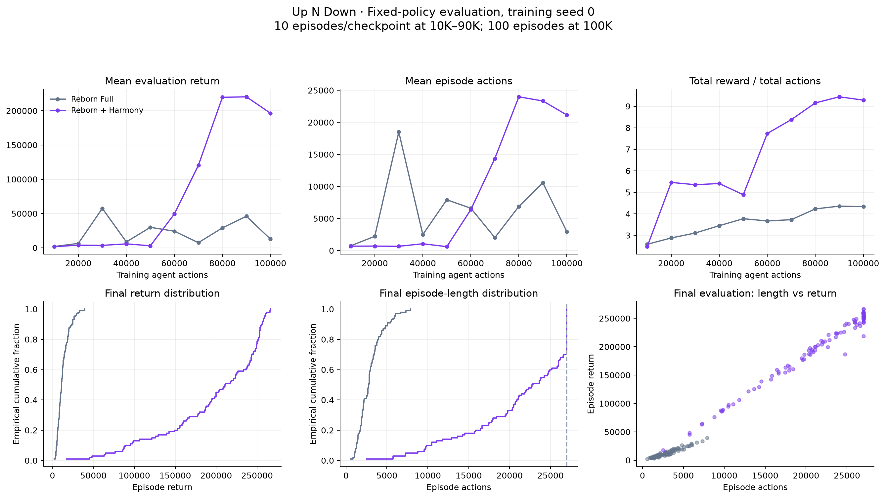

# Up N Down — reporting long episodes and control performance

## 1. Vì sao training curve có khoảng trống?

Mỗi return chỉ được log khi episode kết thúc; độ dài thực = episode_length − 1 callback reset. Kiểm tra tất cả episode cho thấy độ dài khớp chênh lệch action giữa hai lần kết thúc. Các bin65K–70K và75K–95K không có episode kết thúc, không phải score bằng0 hay mất training.

Episode82 chạy từ64,548 đến72,274 actions, return60,540. Episode83 chạy từ72,274 đến97,236 actions, dài24,962 actions và return242,470. Timeline thể hiện toàn bộ khoảng tích lũy thay vì gán return vào từng bin đi qua. Policy vẫn cập nhật trong episode training, nên score này không phải performance của riêng checkpoint97K. Sau97,236, budget100K còn2,764 actions; không coi đoạn chưa có episode hoàn tất tiếp theo là một episode return đầy đủ.

## 2. Evaluation bằng policy cố định

So sánh **Reborn Full và Reborn + Harmony của cùng screening**, không phải DreamerV3. Final dùng100episode mỗi arm tại100K; checkpoint trung gian10episode. Không gọi số episode này là100training seeds.

| Metric final | Full | Harmony |
|---|---:|---:|
| Mean return | 12,748.700 | 196,432.500 |
| Median return | 11,130.000 | 211,230.000 |
| Return P10 | 5,340.000 | 94,411.000 |
| Return P90 | 23,585.000 | 255,604.000 |
| Mean episode actions | 2,940.280 | 21,152.460 |
| Median episode actions | 2,776.000 | 22,793.000 |
| Total reward / total actions | 4.336 | 9.287 |
| Episodes dài đúng27,000 actions /100 | 0.000 | 29.000 |

27,000actions tương ứng giới hạn108,000frames với repeat4 của wrapper. Tỷ lệ chạm độ dài này là **proxy cap-hit**, không phân biệt chắc chắn timeout với game-over xảy ra cùng bước. Không có death-cause riêng trong các episode rows. Các episode chạm cap không cho biết agent sẽ sống thêm bao lâu nếu bỏ cap.

## 3. Score tăng do sống lâu hay kiếm reward nhanh hơn?

$$
\overline R=\overline T\;rac{\sum_i R_i}{\sum_i T_i}.
$$

Tỷ lệ Harmony/Full: **return 15.408× = độ dài 7.194× × reward/action 2.142×**.

Reward/action ở đây là tổng reward chia tổng actions, không phải trung bình của từng tỷ số episode. Đây là đẳng thức phân rã mô tả, không chứng minh tăng độ dài gây tăng score hay component nào gây improvement. Reward/action có thể bị ảnh hưởng bởi phase game và reward schedule.

## 4. Cách dùng trong báo cáo

- Training curve giữ bin trống và marker tại dữ liệu thực; timeline giải thích episode dài.
- Fixed-policy evaluation là bằng chứng chính cho control tại checkpoint; ECDF cho thấy phân phối100episode.
- Báo cả return, length và reward/action; không chỉ chọn episode training cao nhất.
- Kết quả chỉ training seed0, chưa xác nhận độ ổn định nhiều seed hoặc nguyên nhân riêng của Harmony.

[Dữ liệu từng episode evaluation](evaluation_episodes.csv) · [Thống kê và source hashes](analysis.json)

[Training curves26game](../harmony_vs_dreamerv3_26_training_curves/README.md) · [Evaluation curves26game](../harmony_vs_dreamerv3_26_learning_curves/README.md)

Tái tạo: scripts/slurm_upndown_long_episode_report.sh. Chỉ phân tích CPU từ log có sẵn, không train/eval lại.
